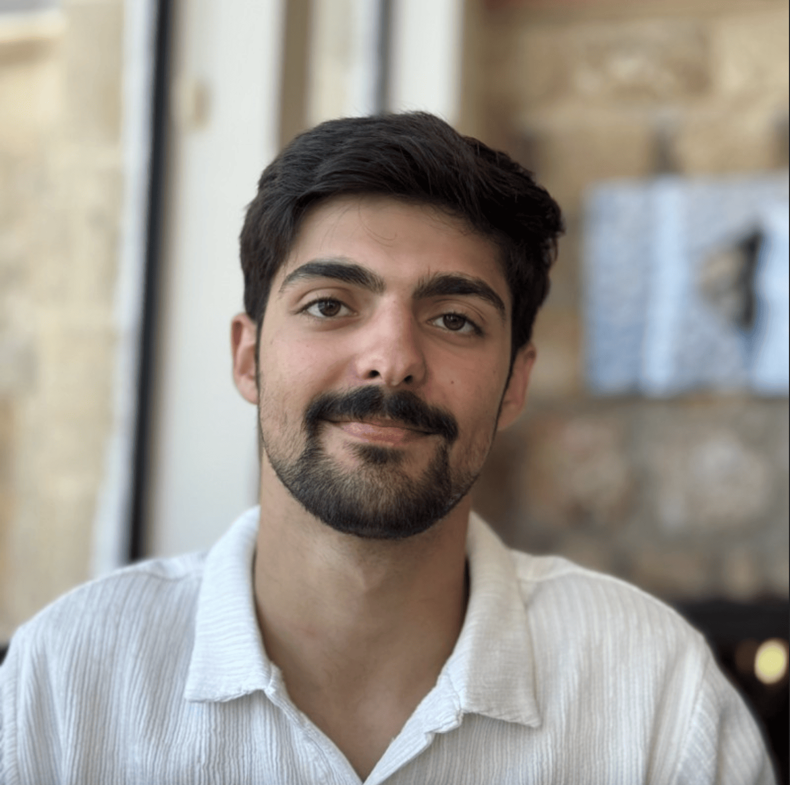

---
hide:
  - navigation
  - toc
---

  

    
    

      <h1>עמית פנחסי</h1>
      
בוגר 8200, יזם, ומחנך טכנולוגי

      

        <a href="https://www.linkedin.com/in/amit-pinchasi-2450a622a" class="link-btn link-btn-primary">LinkedIn</a>
        <a href="https:/www.youtube.com/@amitpinchasi" class="link-btn link-btn-primary">Youtube</a>
        <a href="https://www.instagram.com/amit_pinchasi" class="link-btn link-btn-primary">Instagram</a>
      

    

  

  

    
שמי עמית פנחסי, בוגר יחידת 8200 (מסלול גאמ״א), ועובד בהייטק כבר מגיל התיכון.

    
שותף מייסד בסטארטאפ horizon-trade.com ושותף בהקמת כנסי הסייבר nobstlv.com.

    
בשנים האחרונות הקדשתי חלק משמעותי מזמני לליווי, לימוד והכנה להייטק של עשרות תלמידים בהתנדבות.

    
החזון שלי הוא לאפשר לכל אדם ללמוד מחשבים מאפס ולהגיע לרמה מקצועית גבוהה, שלא נופלת מזו של אנשי המקצוע המובילים בתחום שבו הוא בוחר.

    
כדי לממש את החזון הזה כתבתי מעל 2000 שעות לימוד של קורסים חינמים בעברית שמאפשרים גם לאנשים ללא ידע או ניסיון קודם להתקדם, בעזרת תרגול מעשי רב, לרמה שמאפשרת כניסה לתפקיד ראשון בהייטק.

    
בנוסף קיימים גם קורסים מתקדמים יותר, המותאמים לאנשים עם ניסיון מסוים, בין אם הם רק מתעניינים בתחום ובין אם הם מעוניינים להתפתח מקצועית.

    
הכניסה לעולם המחשבים יכולה להיות מאתגרת ללא הכוונה נכונה. באתר "עמית טק" אני משתף בחינם את הידע שצברתי ואת ההכוונה הדרושה כדי להתחיל ולהתקדם בתחום.

  

  

    <a href="https://horizon-trade.com" class="link-btn link-btn-primary">Horizon Trade</a>
    <a href="https://nobstlv.com" class="link-btn link-btn-secondary">NoBs TLV</a>
  

