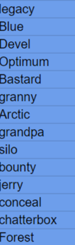
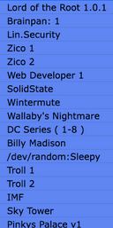
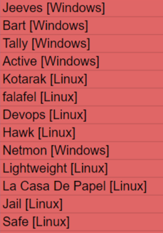
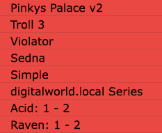

כמו שעשינו מכונות ללינוקס, עכשיו אחרי שסיימנו ללמוד על תקיפות AD- נעשה גם מכונות ווינדוס.
עשו את המכונות הבאות בhackthebox

עשו את המכונות הבאות בvulnhub

אחרי שאתם מסיימים את כל המכונות עשו את המכונות לינוקס ווינדוס האלו בhack the box

ועשו את המכונות האלו הvulnhub
