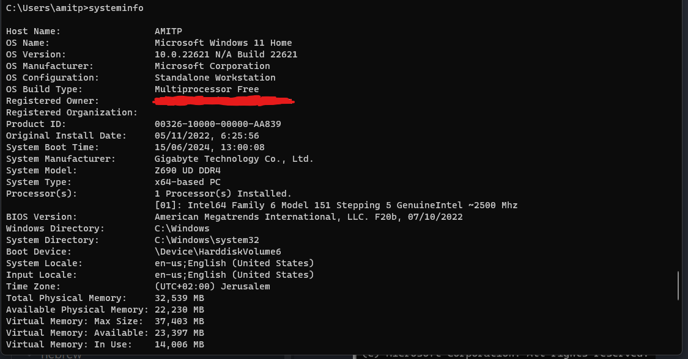
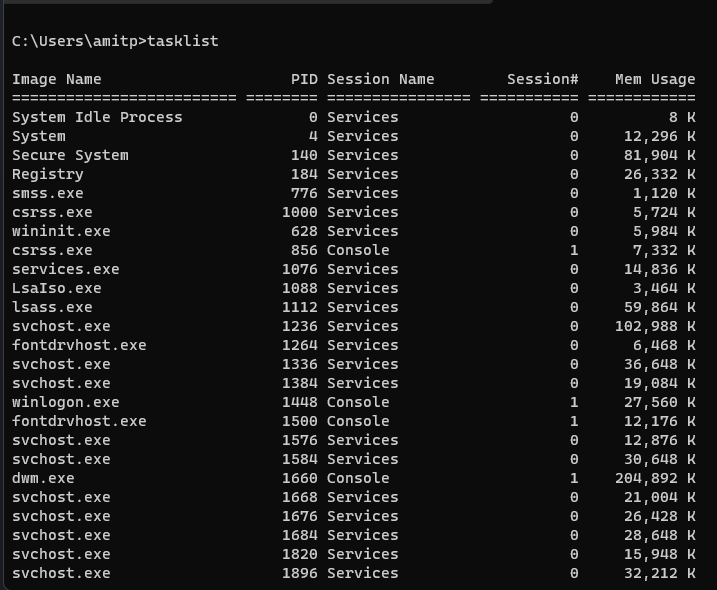
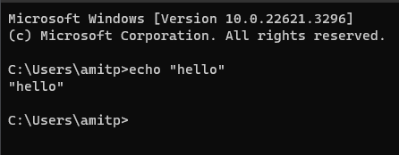
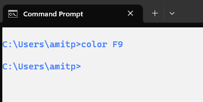
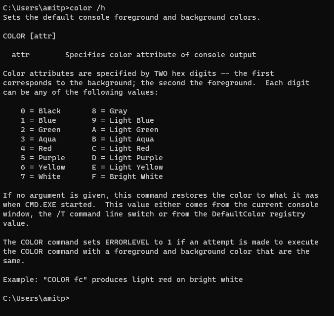

## פקודות בסיסיות בטרמינל


הטרמינל מאפשר לנו להריץ פקודות לניהול ושליטה על המחשב בצורה מהירה ויעילה. כאן נלמד כמה פקודות בסיסיות שכל משתמש צריך להכיר.

### הצגת מידע על המערכת

- הפקודה **`systeminfo`** - מציג מידע מפורט על המחשב, כולל גרסת מערכת ההפעלה, זיכרון, דומיין, ועוד.


  
  

### מידע על המשתמש הנוכחי
  

- הפקודה **`whoami`** - מציג את שם המשתמש המחובר כעת למערכת.


### ניהול processes במערכת

- הפקודה **`tasklist`** - מציג רשימה של כל הprocesses (תוכנות) שרצים כרגע במחשב, כולל זיהוי ה-PID שלהם.





### יציאה מהטרמינל

- הפקודה **`exit`** - סוגר את חלון הטרמינל.

### הדפסת טקסט למסך 

- הפקודה **`echo`** - משמש להדפסת טקסט למסך.

דוגמה:
  
```cmd

echo hello

```


התוצאה תהיה:

```

hello

```




### שינוי צבע הטרמינל

- הפקודה **`color`** - משנה את הצבעים של הטקסט והרקע בטרמינל.

לדוגמה, כדי לשנות את צבע הרקע ללבן ואת הטקסט לכחול (צבעי ישראל):

```cmd

color F9

```



### ניקוי המסך

- הפקודה **`cls`** - מוחק את כל הפלט שהופיע עד כה במסך הטרמינל.

הריצו `cls` ותראו שהמסך מתנקה לחלוטין.

---
## דגלים (Flags) - פרמטרים לפקודות
 

**דגלים** הם פרמטרים שניתן להוסיף לפקודות כדי לשנות את אופן הפעולה שלהן. לכל פקודה עשויים להיות דגלים שונים.

### דוגמה: הצגת אפשרויות הצבע בפקודה `color`

כדי להבין איך להשתמש בפקודה `color`, ניתן להשתמש בדגל `/?`:

```cmd

color /?

```



בהודעת העזרה נראה טבלה עם קודים לצבעים, שבה כל אות מסמלת צבע מסוים. למשל:

- הסימן **`F`** = לבן בהיר (Bright White)
- הסימן **`9`** = כחול בהיר (Bright Blue)

לכן, הפקודה:

```cmd

color F9

```

תצבע את הרקע בלבן ואת הטקסט בכחול.

### כיצד לבדוק אילו דגלים זמינים לכל פקודה?
  
ברוב הפקודות ניתן לקבל עזרה על ידי הוספת אחד מהדגלים הבאים:

- הדגל `/?`
- הדגל `/help`
- הדגל `-h`
- הדגל `--help`

לדוגמה:
```cmd
dir /?
```

נסו לבדוק בעצמכם דגלים נוספים על פקודות שונות כדי להכיר אותן טוב יותר!

---
### סיכום

- **למדנו פקודות בסיסיות בטרמינל** כמו `systeminfo`, `whoami`, `tasklist`, `echo`, `color`, ו- `cls`.
- **דגלים** הם פרמטרים שמוסיפים לפקודות כדי לשנות את הפעולה שלהן.
- **אפשר להשתמש בדגלי עזרה** (`/h`, `/help`, `-h`, `--help`) כדי ללמוד כיצד להשתמש בפקודות חדשות.