## ניוד בין תיקיות וניהול קבצים

### מעבר בין תיקיות

בטרמינל אנחנו תמיד נמצאים בתוך נתיב מסוים (תיקייה במחשב). ניתן לנוע בין תיקיות בעזרת הפקודה `cd` (קיצור של _change directory_ - שינוי תיקייה). בנוסף, אפשר להשתמש בפקודה `dir` כדי לראות את הקבצים שבתוך התיקייה הנוכחית.
- אם אתם צריכים חזרה על זה חזרו לשיעור הראשון הפרק בו אנחנו לומדים על הפקודות הללו.

### יצירת תיקייה

- ניתן ליצור תיקייה חדשה בעזרת הפקודה `mkdir` (_make directory_ - צור תיקייה):
 
 ```cmd
 mkdir NewFolder
 ```
 
 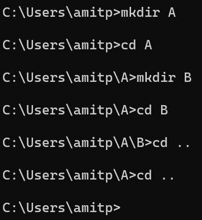

### מעבר לתיקייה אחרת

- כדי להיכנס לתיקייה מסוימת, נקליד `cd` ואת שם התיקייה:
 
 ```cmd
 cd NewFolder
 ```
 
 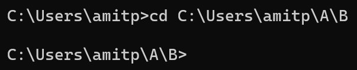
 
- כדי לחזור אחורה תיקייה אחת:
 
 ```cmd
 cd ..
 ```
 
- כדי לחזור אחורה שתי תיקיות:
 
 ```cmd
 cd ../..
 ```
 
 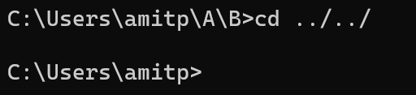
 

### מחיקת תיקיות

- ניתן למחוק תיקייה בעזרת `rmdir` (_remove directory_ - מחיקת תיקייה):
 
 ```cmd
 rmdir NewFolder
 ```
 
 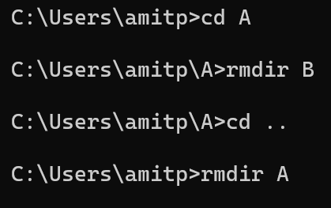

### יצירה, קריאה ומחיקה של קבצים

- ניתן ליצור קובץ ולכתוב לתוכו נתונים בעזרת `>`:
 
 ```cmd
 whoami > file.txt
 ```
 
 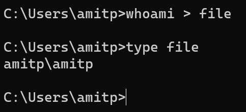
 
 ניתן לקרוא את תוכן הקובץ בעזרת `type`:
 
 ```cmd
 type file.txt
 ```
 
 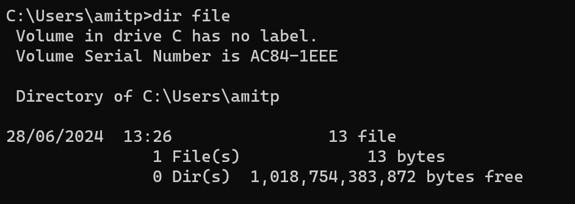
 
- מחיקת קובץ:
 
 ```cmd
 del file.txt
 ```
 
 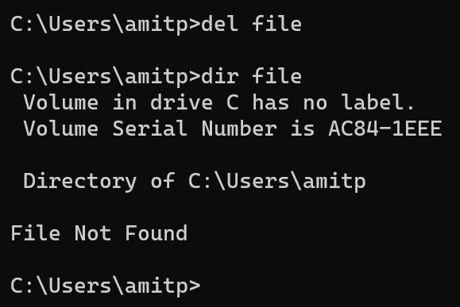
 
- ניתן להוסיף תוכן לקובץ קיים בעזרת `>>`:
 
 ```cmd
 echo "Hello World" >> file.txt
 ```
 
 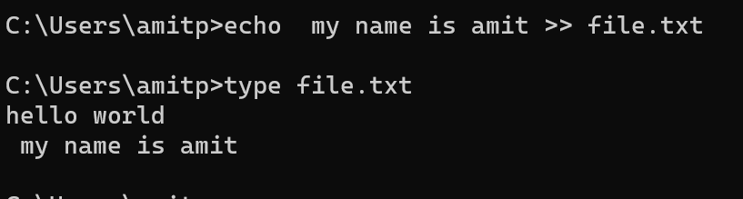
 

### שינוי שם והעתקת קבצים

- שינוי שם קובץ (בעזרת `move`):
 
 ```cmd
 move file.txt file2.txt
 ```
 
 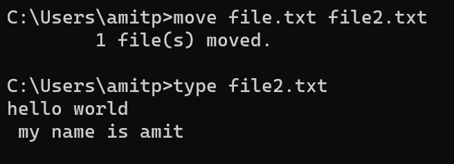
 
- העתקת קובץ למיקום אחר (בעזרת `copy`):
 
 ```cmd
 copy file2.txt C:\Users\amitp\Documents
 ```
 
 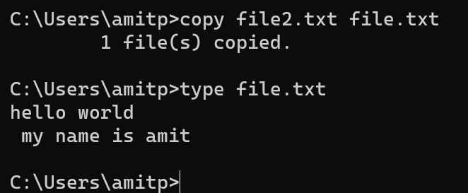
 

### פתיחת קובץ בעורך טקסט

- ניתן לערוך קובץ בעזרת `notepad`:
 
 ```cmd
 notepad file3.txt
 ```
 
 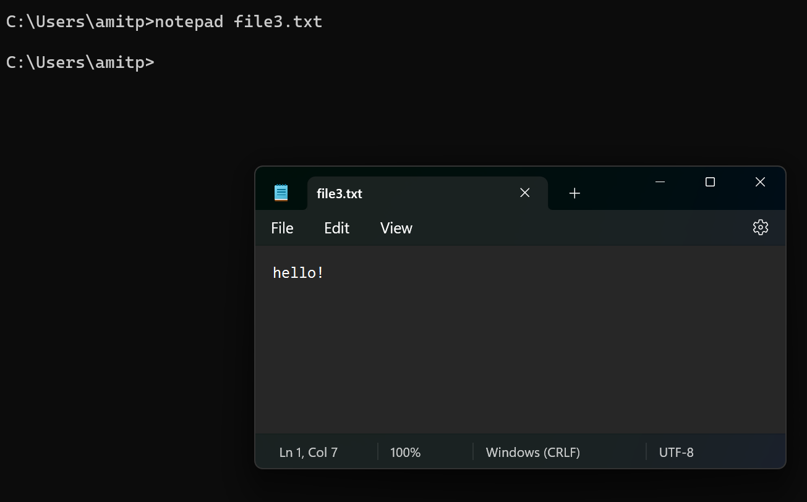

### חיפוש תוכן בתוך קובץ

- ניתן לחפש מחרוזת בתוך קובץ בעזרת `find`:
 
 ```cmd
 find "he" file3.txt
 ```
 
 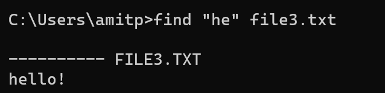

### חיבור פקודות עם Pipe

- `|` (_pipe_ - צינור) מחבר בין פקודות: הפלט של הפקודה הראשונה מועבר לקלט של הפקודה השנייה. לדוגמה, כדי לחפש אם התוכנה `Notepad` רצה:
 
 ```cmd
 tasklist | find "Notepad"
 ```
 
 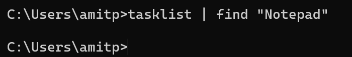
 
- אם `Notepad` רצה, נקבל פלט: 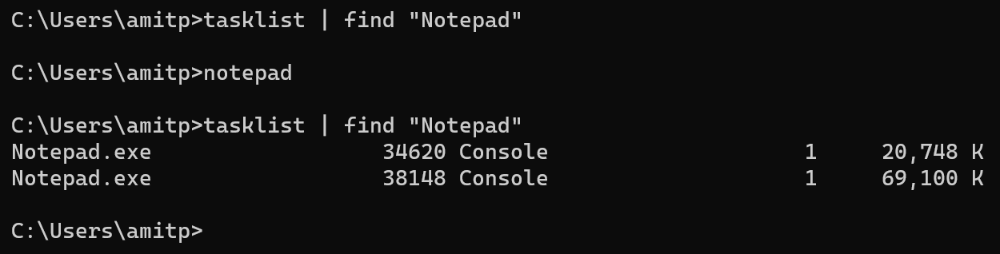
 

### סיכום

- **למדנו כיצד לנוע בין תיקיות** (`cd`, `mkdir`, `rmdir`).
- **יצרנו קבצים, כתבנו לתוכם וקראנו את תוכנם** (`>`, `>>`, `type`, `del`).
- **שינינו שם לקובץ והעתקנו קובץ למיקום אחר** (`move`, `copy`).
- **פתחנו קובץ ב-Notepad**, חיפשנו תוכן בקובץ (`find`).
- **למדנו על שימוש ב-Pipe לחיבור בין פקודות**.