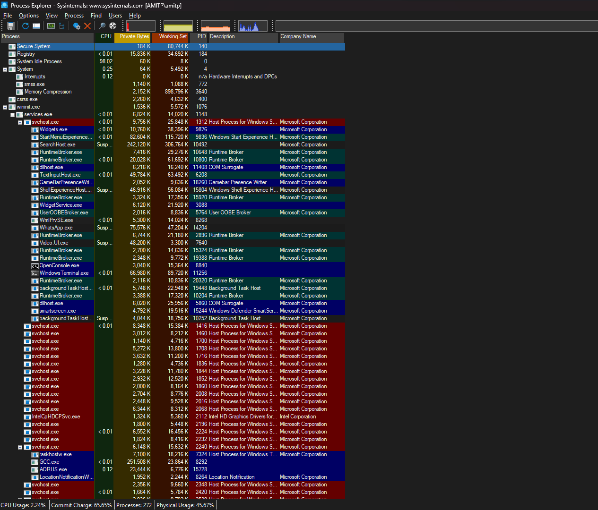
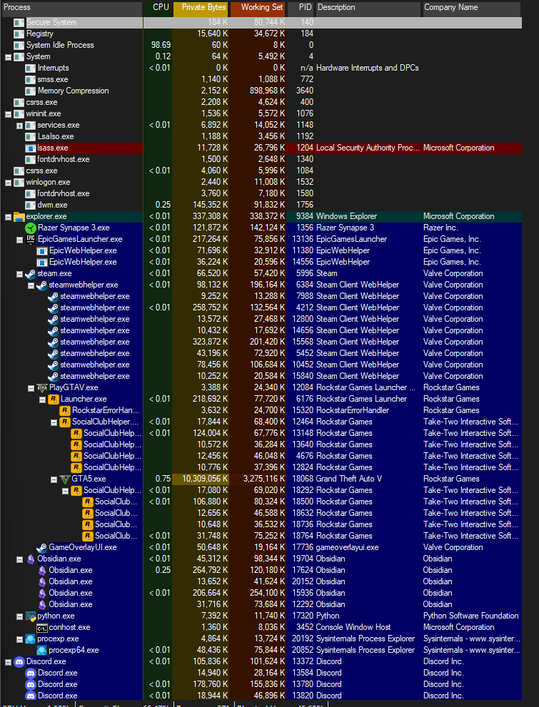
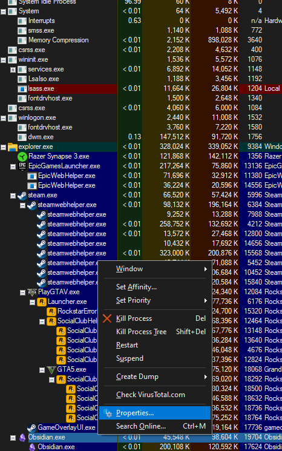
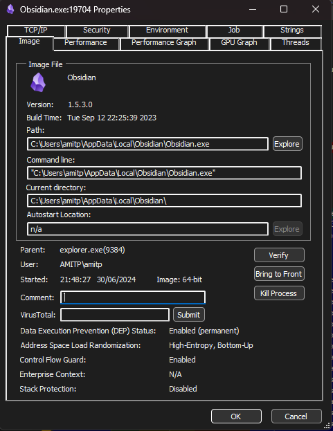
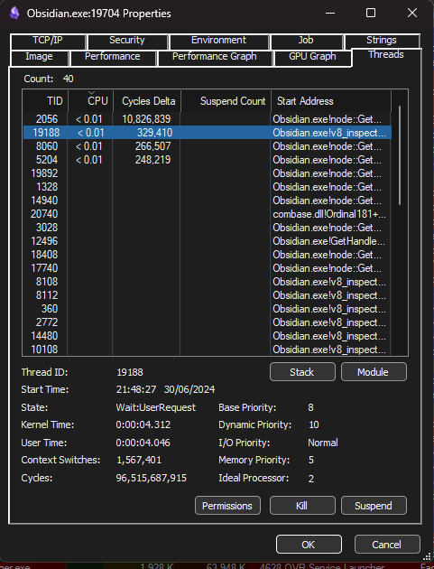
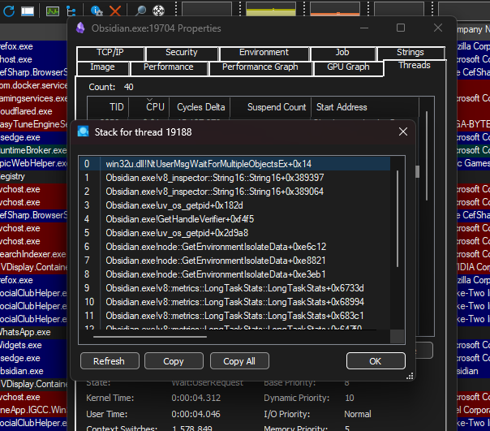
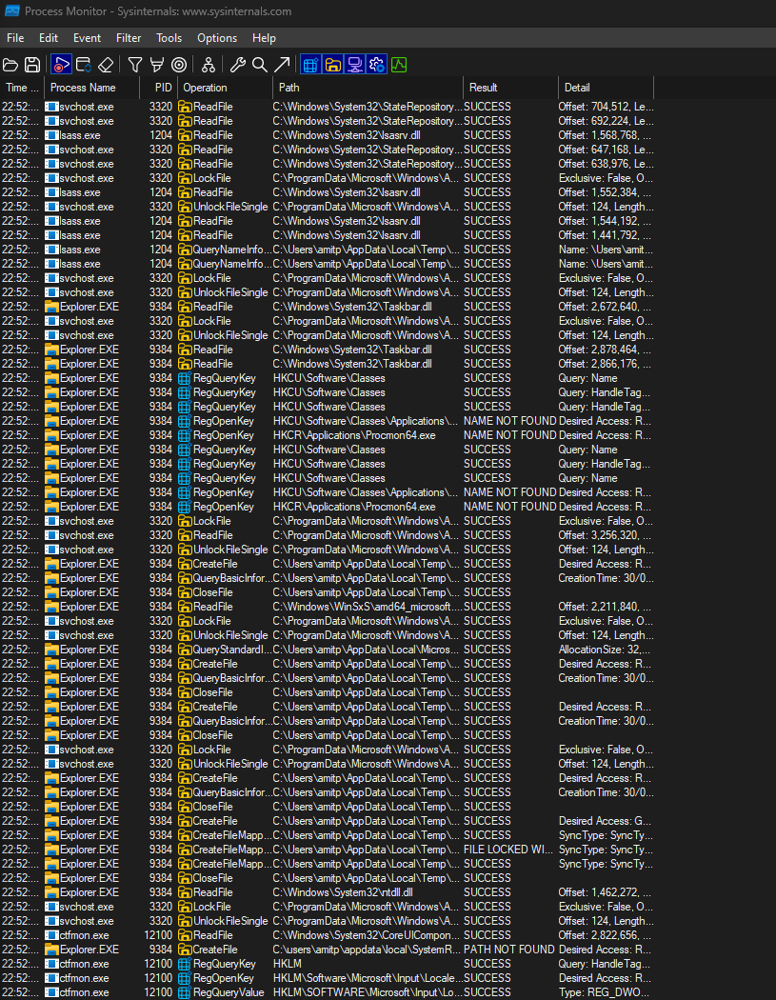
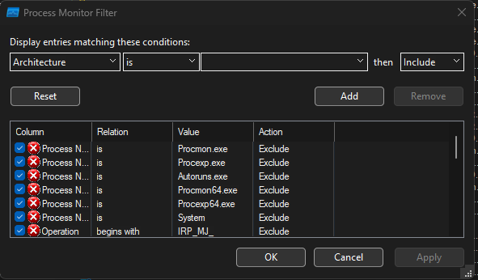
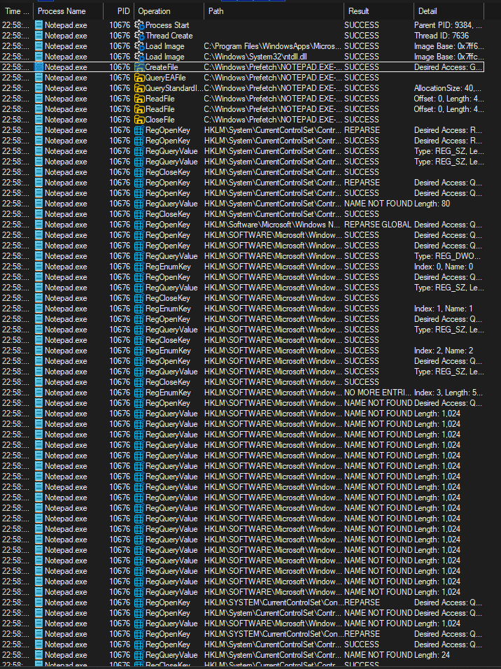

## תהליך - process
- תהליך, או באנגלית "process" זה תוכנה שרצה במחשב. אפשר להגיד שכל התוכנות שרצות במחשב הם processes במערכת ההפעלה שלנו.
- במערכת הפעלה מודרנית כמו ווינדוס, processes יכולים לרוץ במקביל, (תוכנות יכולות באותו הזמן) ואומנם זה נשמע לנו ברור מאילו אבל זה לא כל כך. ונדבר בהרצאה הזו קצת על איך שזה קורה
- הprocesses יכולים גם ליצור עוד processes, כמו למשל שהטרמינל הוא process, והטרמינל יכול להריץ עוד processes (תוכנות אחרות). זה הופך את הטרמינל לprocess אב, ואת הפקודה שרצה להprocess בן של הprocess של הטרמינל.

## תהליכונים - threads
- המון פעמים יש לנו מצבים שגם תוכנה (process), צריך הוא בעצמו להריץ מספר דברים במקביל, נקח לדוגמה את הדפדפן שלנו - יכול להיות שנפתח בדפדפן בטאב אחד יוטיוב, ובטאב שני את הקורס, אז הprocess של הדפדפן יצטרך גם לנגן את הסרטון שאנחנו רואים ביוטיוב וגם להפעיל את האתר של הקורס. 
- הדרך שבה זה קורה זה באמצעות threads, thread הוא בסוף משהו שמריץ קוד, ולכל process יכול להיות מספר threads, זאת אומרת שיכול להיות שלמשל לתוכנת הדפדפן שלנו יש 4 threads, וזה אומר שהתוכנה מריצה 4 דברים במקביל. 
- אם יש לנו במערכת לדוגמה 3 processes, ולכל אחד מהprocesses יש 3 threads, סהכ קיימים 9 threads במערכת - 9 threads שצריכים להריץ קוד במקביל- זה המון.
- אבל כיצד באמצעות מעבד אחד נריץ 9 דברים שונים במקביל? במיוחד שאפילו כל אחד threads צריך גם זכרון נפרד.

## שינוי קונטקסט - context switch
- כאשר המעבד צריך להריץ מספר threads במקביל, המעבד עושה דבר שנקרא "שינוי קונטקסט" (context switch).
- שינוי קונטקסט הוא מצב שבו המעבד כדי להריץ מספר threads במקביל, ממש עובר ממש מהר בין threads כך שזה יראה למשתמש כיאלו שכולם רצים באותו הזמן.
- דמיינו והמעבד שלנו צריך להריץ שני threads, המעבד פשוט יריץ שורת קוד אחת מהprocess הראשון, מהר יעבור לשני ואז יריץ שורת קוד בקוד השני וכך ימשיך בצורה מהירה מאוד. כך שלנו המשתמשים זה יראה כיאלו שני הthreads האלה ממש רצים באותו הזמן, במקביל.

## ליבות מעבד
- אז במעבדים מודרנים יש כמה ליבות, וכל ליבה יכולה להריץ thread. כך שיש מעבדים שבאמת יכולים להריץ מספר threads במקביל בלי צורך בשינוי קונטקסט.
- דמיינו ומעבד שלנו יש 4 ליבות (מעבד סטנדרטי), ויש לנו  50 processes במחשב, ולכל process בממוצע יש 3 threads כך שסה"כ יש לנו 150 threads שצריכים לרוץ. זה אומר שבערך כל ליבה צריכה להריץ 37 threads במקביל, עכשיו בחיים האמיתיים לכל process יש עדיפות - "priority" והיא מוגדרת על ידי המשתמש והמערכת הפעלה. כך שבתכלס אומנם יש לנו 150 threads שצריך להריץ אבל לכל אחד יש "עדיפות" אחרת.
- אז, איך נוכל לתכנן קוד שיודע להגיד איזה thread צריך לרוץ מתי ובאיזה ליבה?

## מתזמן - scheduler
- הscheduler זה תוכנה שנמצאת בקרנל שיודעת לחשב בדיוק איזה thread צריך לרוץ על איזה ליבה במעבד.
- לכל thread במערכת ההפעלה יש עדיפות, וזה בדרך כלל מספר שאומר עד כמה הthread הזה קריטי - אם המספר גבוהה אז הוא יקבל יותר זמן לרוץ בליבות כך שהthread ירוץ יותר מהר משאר הprocesses. וגם בזה הscheduler צריך להתחשב.
- הscheduler זה תוכנה מסובכת, ויש המון אלגוריתמים שכתבו לscheduler. מוזמנים לקרוא עליהם באינטרנט.

## פרוסס אב, ופרוסס בן
- בדרך כלל ברוב המערכת ההפעלה- אפשר לצייר את הפרוססים כמעין עץ. כאשר קיים הפרוסס הראשון במערכת ההפעלה שהקרנל אחראי ליצור, והפרוסס הזה יוצר את כל הפרוססים האחרים. 
- פרוססים יוצרים פרוססים אחרים, כאשר אנחנו משתמשים בשולחן העבודה כדי להריץ פרוססים במערכת- אפשר להגיד שהפרוסס של שולחן העבודה יוצר פרוססים אחרים. וזה הופך אותו לפרוסס אב, ואת הפרוסס שהרצנו לפרוסס בן שלו.
- זה בא לידי ביטוי בטרמינל, כאשר הפרוסס של הCMD הוא הפרוסס אב, וכל הפקודות שאנחנו מריצים בטרמינל הן הפרוססי בנים שלו.

## הכלי procexp
- בהרצאה נעבור על הכלי procexp של sysinternals, פתחו אותו בתקיית sysinternals שלכם. הוא אמור להיראות כך:
  
  - אפשר לראות שיש לנו פה רשימה של כל הprocesses שלנו במחשב, ואפשר לראות שזה נראה ממש כמו עץ
  - העץ הזה מתאר את הקשרים אבא ובן של כל הprocesses, למשל אפשר לראות שהprocess wininit מריץ את הprocess services שמריץ מלא processes בשם svchost - שאני מזכיר לכם, אלו processes של service-ים של מערכת ההפעלה. אם נלחץ על המינוס כדי לסגור את services, אפשר לראות עוד המון processes אחרים במערכת:
    
- אפשר לראות אצלי שפתוחות המון תוכנות, וכולן פתוחות על ידי הprocess אב explorer, שהוא אחראי על השולחן העבודה.
    
- אם נבחר process, למשל obsidian ונלחץ מקש ימני ונבחר properties נוכל לראות המון מידע על הprocess:
      
- נוכל לראות גם רשימה של כל הthreads של הprocess:
        
- אם נפתח את הstack של הthread נוכל לראות אפילו איזה פונקציות בלייב הthread מריץ, משוגע!
	  
- שימו לב שבstack אפשר לראות ממש פונקציות של winapi, ואפילו קוד קרנלי שרץ!
- אם תחפרו קצת בתוכנה תוכלו למצוא את הקבצים שכל thread פותח, ואפילו המקורות אליהם הוא ניגש באינטרנט.
- אפשר לראות לכל פרוסס שיש גם PID, שזה מזהה מיוחד שיש לכל פרוסס במערכת שמציין את הID שלו- מספר יחודי שיש רק לו. PID זה קיצור של process id. 
- בנוסף יש לכל פרוסס PPID, שזה parent process id, שמציין את הID של הפרוסס אב שלו.

- הכלי procexp, או בשמו המלא "process explorer" הוא משוגע, והוא נותן לנו לבחון processes (פרוססים) במערכת ולקבל עליהם המון מידע. ממש task manager על סטראוידים!

## הכלי procmon
- אז כמו procexp שנותן לנו לקבל מידע כללי על כל הפרוססים במערכת, הכלי procmon או בשמו המלא "process monitor" נותן לנו לקבל גישה למידע קונקרטי על פרוססים בלייב, כמו איזה קבצים הם ניגשים אליהם, איזה מפתחות בregistry, ועוד.
- פתחו את הכלי procmon בתקייה של sysinternals, הוא אמור להיראות כך בערך:
  
- הכלי הזה זורק לנו המון מידע על המון פרוססים, אז נרצה לפלטר - נוכל לעשות את זה באמצעות לחיצה על "filter" למעלה ואז שוב על filter. ויפתח לנו חלון כזה:
  
  - בו תוכלו לפלטר על איזה דברים תרצו, למשל כדי לפלטר על שם של פרוסס, תוכלו לבחור "Process Name" ואז למשל Notepad.exe
    
    ואז לחצו על add, ואז apply וok
    - עכשיו פתחו את notepad
      
      - אפשר לראות שהתוכנה פתחה המון קבצים, וניגשה להמון מפתחות בregistry
      - התוכנה procmon מאפשרת לנו ממש לנטר על פעולות שפרוססים ותוכנות עושים על המחשב שלנו, וזה מאוד חזק. אנחנו יכולים עכשיו לדוגמה ללמוד ולחקור כיצד התוכנה notepad  עובדת ועל דברים שהיא עושה באמצעות הכלי procmon.