## דיסקליימר
בפרק הבא ההרצאות מידי ארוכות, קחו את הזמן- תעכלו את החומר, תקראו על כל מה שנלמד עוד עם הchatgpt ובגוגל- זה בסדר אם כל הרצאה ותרגול יקח לכם הרבה זמן, 
לכל הרצאה בפרק יש המון תוכן חדש.
## הקדמה
המעבד שלנו היא מכונה משומנת שיודעת לקבל הוראות, בבינארית ולבצע אותן.
בעבר מתכנתים היו ממש כותבים תוכנות בבינארית ישירות בתוך הזכרון (ממש מדליקים ביטים מסוימים בRAM)
להוראות אלו, נקרא בשם יותר מקצועי- "שפת מכונה"

העולם התפתח וקצת השתנה- הוסיפו מגנונים שונים למחשב (ולא הרבה) ופיתחו המון תוכנות מעל המעבדים האלו.


 המצאה היסטורית שהגיעה אלינו ב1956 היא המצאת "האחסון"- התקן שמחובר למעבד שמאפשר לשמור כמות מידע רחבה מאוד- יותר מאשר הRAM שאנחנו מכירים, ויודעת לוודא שהמידע נשמר גם לאחר שהמחשב מתכבה.
כך רכיב האחסון מאפשר למתכנתים לכתוב תוכנות ששומרות מידע פרסיסטנטי על הדיסק.

עוד המצאה באותה התקופה הייתה ה"אסמבלר".
האסמבלר היא תוכנה, שאיפשרה לנו לכתוב תוכנות לא בבינארית, אלה בשפת תכנות שנקראת "אסמבלי"- שפה זאת מאפשרת לנו לכתוב הוראות למעבד במילים ולא בבינארית.
האסמבלר היא תוכנה שידעה להמיר את ההוראות שכתבנו במילים, ולהפוך אותם לשפת מכונה (הוראות בבינארית) שמעבד יודע להריץ. 

נרוץ קצת קדימה בזמן ל1981, בשנה זו פותחה אחת ממערכות ההפעלה הראשונות והפורצות דרך בהיסטוריה- MS-DOS (microsoft disk operating system),
הMS-DOS היא תוכנה שנכתבה בעיקר למתכנתים, ומטרתה הייתה לאפשר למתכנתים לכתוב תוכנות למעבד שלהם, ולהריץ אותן בפשטות.
מערכת הפעלה היא תוכנה גדולה ובסיסית שרצה על המעבד, מערכת הפעלה יודעת לנהל את המעבד ולתת interface נוח למשתמשים לעבודה עם המחשב.

הMS-DOS היא מערכת הפעלה שהיה לה המון פיצ'רים, איפשרה למשתמשים שלה לשמור מידע ב"קבצים" ו- "תיקיות".
בנוסף בMS-DOS היה "טרמינל" פשוט, שאיתו מתכנתים יכלו לעבוד ולנהל את מערכת ההפעלה שלהם ובין היתר גם את הקבצים.
הMS-DOS היה גם תוכנת אסמבלר, אשר מאפשרת למתכנתים לכתוב קוד אסמבלי, לשמור אותו בדיסק- ולהמיר את האסמבלי לשפת מכונה ולהריץ אותו בתוך מערכת ההפעלה.

דמיינו תוכנה אחת שתוכלו להריץ על המחשב שלכם, שתאפשר לכם גם לכתוב מידע באחסון בצורה פשוטה עם טרמינל, גם לכתוב תוכנות, ולהריץ אותן בתוך הinterface שלה.
כלומר, תוכנה שיודעת ממש להריץ תוכנות אחרות שאתם כותבים בתוכה!


## מעבד ה8086
אחת מפריצות הדרך הגדולות בהיסטוריה היא פיתוח מעבד ה8086.
ה8086 הוא מעבד שפותח על ידי חברת אינטל ב1978 ועל בסיסו פותחה הארכטיקטורת מעבדים הפופלרית ביותר בעולם ה-"x86" שעד היום מפותחים המון מעבדים על בסיסה.

בפרק הזה נלמד כיצד לפתח קוד אסמבלי למעבד ב8086 מעל מערכת ההפעלה MS-DOS.
פרק זה יהווה לנו בסיס לפיתוח אסמבלי במעבדים עדכניים יותר, ופיתוח Low level בכלל.

## הכנות 
תוכלו להרים אימולטור של מעבד 8086 ו-MS-DOS כמערכת הפעלה באמצעות אימולטור "DOSBox"
פתחו את הקישור הבא:
https://www.dosbox.com/download.php?main=1
ולחצו על "Download Now"
יפתח לכם האתר הבא:
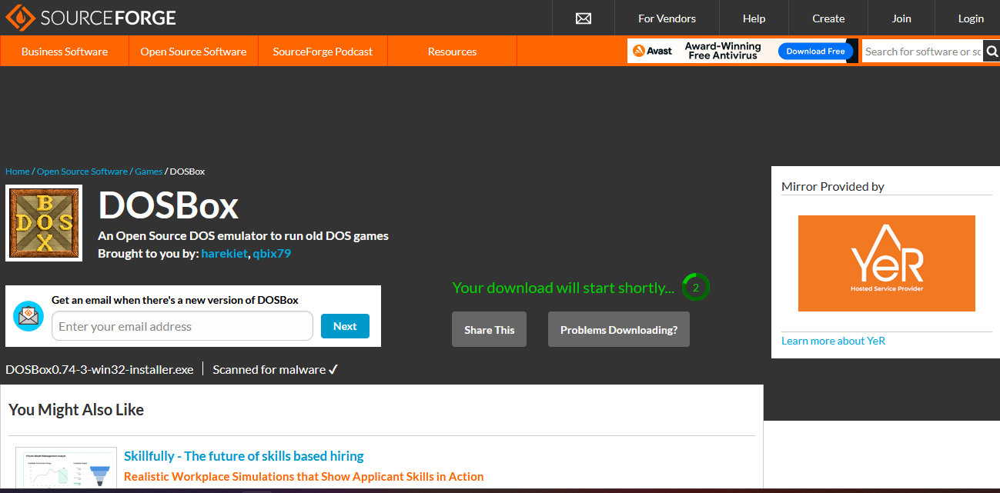
המתינו כמה שניות עד שיורד לכם התוכנה. 
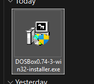
הריצו אותה.
אחרי סיום ההתקנה כאשר תחפשו "DOSBox" בחיפוש תראו את התוכנה הזו:
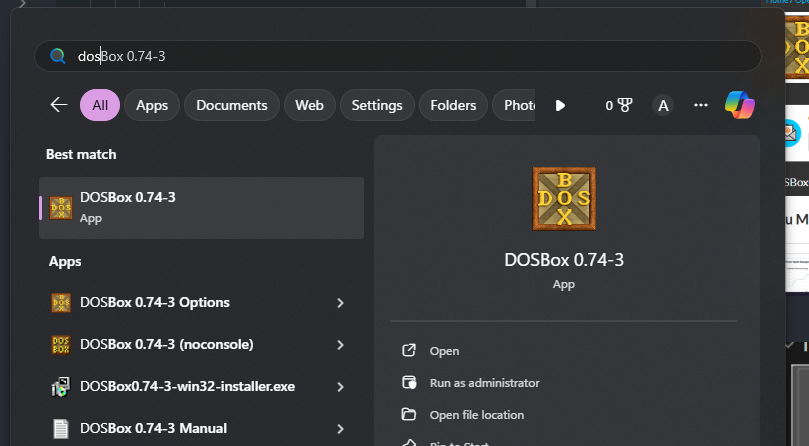
תפתח לכם התוכנה:
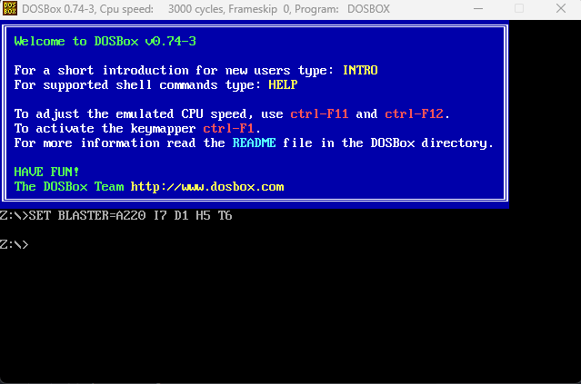
זה אימולטור של DOSBox!
מערכת ההפעלה MS-Dos הינה מערכת ההפעלה הראשונה של מיקורסופט, ומערכת ההפעלה ווינדוס המודרנית מבוססת עליה- פקודות שלמדתם בקורס "ווינדוס בסיסי" חלקן יהיו רלוונטיות גם עכשיו. הקלידו את הפקודה "dir" כדי לראות את כל הקבצים בתקייה שאתם נמצאים בה.
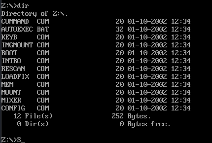
כדי לוודא שהאימולטור רץ עם כמה שיותר משאבים, כתבו את הפקודה `cycles=max`
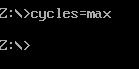
עכשיו כדי להתחיל לכתוב קוד אסמבלי, נרצה לכתוב אותו אצלנו במחשב. 
נכין תקייה אצלנו במחשב, עם הקוד אסמבלי שאנחנו כותבים (באיזה text editor שנבחר), עם אסמבלר ודיבגר.
לאחר שנסיים להכין את התקייה, נוכל ליצור ליצור קישור בין התקייה אצלנו למחשב לתקייה באימולטור באמצעות הפקודה "mount" (בדומה לmount שלמדנו בקורס לינוקס).

עורך טקסט שאני ממליץ עליו לפיתוח אסמבלי הוא notepad++, אבל מוזמנים להשתמש באיזה עורך טקסט שאתם מעדיפים.
האסמבלר שנשתמש בו הוא TASM (הturbo assembler), הכנתי לכם תקייה מקובצת עם האסמבלר, והדיבגר בקישור "https://amittech.dev/everything.zip"

חלצו את התקייה בכונן C, שלכם בנתיב שתבחרו- אני חילצתי ב C:/everything.
הריצו עכשיו פקודת mount, כדי למפות את התקייה שלכם במחשב לדיסק על האימולטור
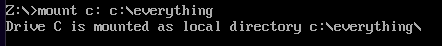
עכשיו תוכלו להחליף את הכונן שאתם נמצאים בתוכו כמו בווינדוס, באמצעות הקלדת: `c:`
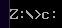
ועכשיו אם נעשה dir נוכל לראות את כל הקבצים שלנו 
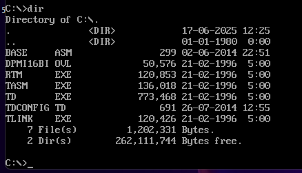
שימו לב שבתקייה שלנו יש קובץ בשם base.asm
הוא מכיל קובץ אסמבלי בסיסי, בשיעור הבא נדבר על הקוד שנמצא בו.
כדי להפוך את הקובץ אסמבלי לקובץ הרצה, כתבו את הפקודה 
```
tasm /zi base.asm
```
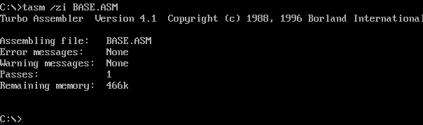
פקודה זו תיצור לנו קובץ שנקרא "base.obj", הוא בעצם קובץ שמכיל את הקוד מכונה.
כדי שנוכל לגרום למערכת ההפעלה שלנו להריץ את קוד המכונה שיצרנו, אנחנו נצטרך להמיר את הקובץ לפורמט מיוחד שמערכת ההפעלה יודעת להריץ.
בווינדוס ו- DOS, פורמט זה נקרא פורמט "DOS MZ"- כל קובץ הרצה כזה, בדרך כלל נגמר ב.exe
כדי לעשות זאת, כתבו את הפקודה
```
tlink /v base.obj
```

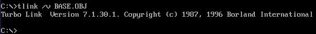
ופקודה זו יצרה לנו את base.exe. נוכל להריץ אותו עכשיו אם נקליד את שם התוכנה ועם לחיצה על אנטר.
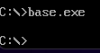
אומנם הרצת הקובץ לא עשתה כלום, כי הקוד שלנו ריק.

## הדיבגר - turbo debugger - TD
חוץ מהאסמבלר והלינקר שמאפשרים לנו לקחת אסמבלי וליצור איתו קובץ הרצה של DOS שאנחנו יכולים להריץ במערכת ההפעלה שלנו, יש לנו עוד תוכנה חזקה מאוד בסל הכלים שעדיין לא השתמשנו בה.
הדיבגר (debugger) שלנו- הturbo debugger, דיבגר זה מאפשר לנו להריץ את התוכנה הוראה אחרי הוראה, ולראות את ההוראות שרצות במעבד- הרגיסטרים, והזכרון משתנה בלייב. 
כדי לריץ דיבגר על הexe שלנו הריצו את הפקודה: 
```
td base
```
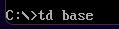
תפתח לכם החלון הזה, שבו תוכלו לראות את הדיבגר עם הקוד אסמבלי שלנו.
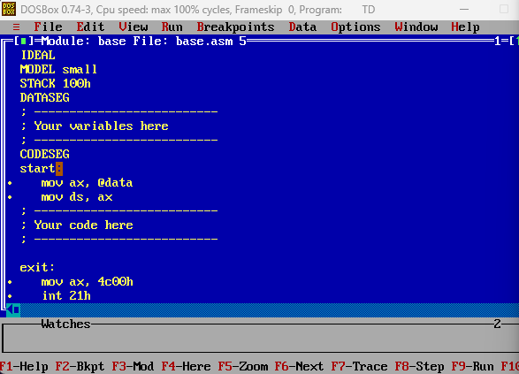
אם לחצתם על החלון, כנראה העכבר שלכם נתקע בתוכו- לחצו על `alt` + `tab` כדי לצאת מהחלון.

לחצו על "view למעלה", ואז בחרו ב"cpu"
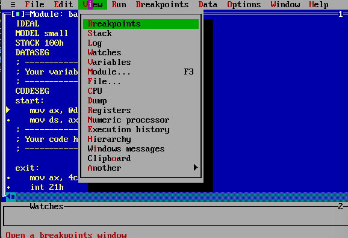
יפתח לכם החלון הבא
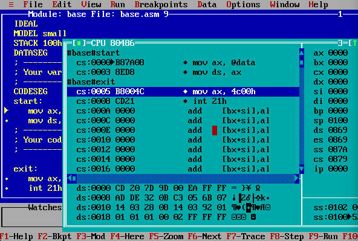
עכשיו תוכלו לגרור את החלון לאן שתרצו עם העכבר ולהגדיל אותו:
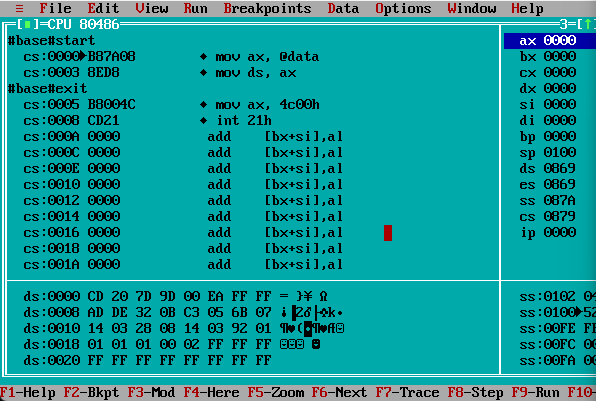
בחלון זה ניתן לראות את מצב המעבד.
ניתן לראות מימין את כל הרגיסטרים, מלמטה את הdata segment (סגמנט המשתנים)
ובאמצע את הקוד שרץ כרגע.
כאשר מצד ימין ניתן לראות את האסמבלי ומצד שמאל ממש את השפת מכונה (ממש ההוראות בהקס).
בדיבגר נוכל להריץ הוראה הוראה את כל ההוראות, כאשר מקש ה "F8" על המקלדת שלנו, יאמר למעבד לרוץ עוד הוראה.
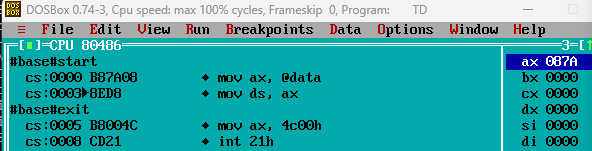
לאחר לחיצה על F8 ניתן לראות שהחץ שליד ההוראה זז למטה פעם אחת, כלומר ביצע את ההוראה הקודמת.
בנוסף שימו לב שההוראה הקודמת הייתה הוראת mov שמשנה את רגיסטר ax.
ובאמת ניתן לראות שרגיסטר ax השתנה לערך 87A בהקסה, ניתן לראות זאת מימין למסך.

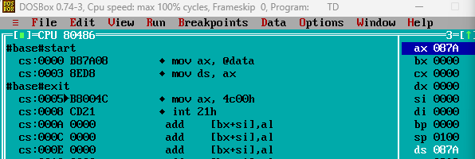
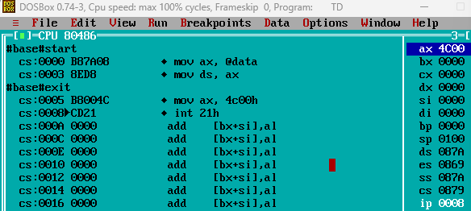
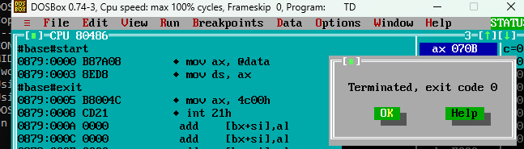
לאחר שסיים לרוץ הקוד, אנחנו נראה כי אנחנו מקבלים הודעת "Terminated- exit code 0".
הexit code מעיד על כך שהתוכנה סיימה לרוץ בהצלחה, לחצו על ok.

