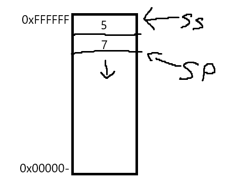

# המחסנית (Stack) במעבד 8086

## מהי מחסנית?

**מחסנית (Stack)** היא מבנה נתונים מהסוג "האחרון שנכנס הוא הראשון שיוצא" (LIFO – Last In, First Out).  
המשמעות היא: הנתון האחרון שנכניס למחסנית – יהיה הראשון שייצא.

כדי לממש פונקציות באסמבלי, אנחנו צריכים מחסנית.

- לשמירת ערכים זמניים (משתנים לוקלים של פונקציה)
- לשמירת כתובות חזרה מקריאות לפונקציות
- להעברת פרמטרים בין פונקציות
- לשמירת מצב רגיסטרים בקריאה לפונקציות

## איך זה עובד במעבד 8086?

המחסנית מנוהלת באמצעות שני רגיסטרים:

- אוגר ה**SP (Stack Pointer)** – מצביע על ראש המחסנית 
- אוגר ה**SS (Stack Segment)** – מסמן את תחילת המחסנית

כך כך ש, SS:SP היא הכתובת של סוף המחסנית.
### חשוב לדעת:

- במחסנית, ברירת המחדל היא **מלמטה למעלה** – כלומר, הכתובות במחסנית **קטֵנות ככל שמוסיפים עוד ערכים.**



- הפקודה `PUSH` דוחפת ערך למחסנית, כך שהיא מקטינה את SP ושמה את הערך בזכרון.

- הפקודה `POP` שולפת ערך מהכתובת ש־SP מצביע עליה (מהמחסנית/זכרון), ואז מגדילה את SP- ובכך מקטינה את המחסנית.

---

## פקודות עבודה עם המחסנית

### `PUSH`

הפקודה `PUSH` דחופת ערך כלשהו (רגיסטר או ערך) למחסנית.

```asm
mov ax, 1234h
push ax
```

מה קורה כאן בפועל?

1. `SP = SP - 2`

2. כתוב את הערך של `AX` אל `[SS:SP]` (1234)


הסיבה שמורידים 2 מ-SP היא כי מעבדי x86 עובדים ב-16 ביטים (גדלי 16 ביטים של רגיסטרים), ולכן כל ערך ש־PUSH כותבת למחסנית הוא בגודל 2 בתים.

---

### `POP`

הפקודה `POP` שולפת ערך מהמחסנית לתוך רגיסטר.

```asm
pop bx
```

מה קורה כאן?

1. קרא ערך מהכתובת `[SS:SP]` לתוך `BX`

2. `SP = SP + 2`


---

### דוגמה מלאה:

```asm
mov ax, 1111h
mov bx, 2222h

push ax    ; pushes 1111h onto the stack
push bx    ; pushes 2222h onto the stack

pop cx     ; CX gets BX → 2222h
pop dx     ; DX gets AX → 1111h
```


---

### פקודות נוספות: `PUSHA` ו־`POPA`

במעבד 8086 ומעלה קיימות הפקודות:

- הפקודה  `PUSHA` – דוחפת את כל הרגיסטרים הכלליים למחסנית (`AX`, `CX`, `DX`, `BX`, `SP`, `BP`, `SI`, `DI`)

- הפקודה `POPA` – שולפת את כל הרגיסטרים מהמחסנית חזרה


```asm
pusha
; ... doing something...
popa
```

## פונקציה
אם הייתם צריכים לממש פונקציות מעל מעבד, כיצד הייתם עושים זאת?
כדי לענות על השאלה, קודם אנחנו צריכים לפרק את התנהגות של פונקציות. 
מה יש לפונקציה?
1. לכל פונקציה יש פרמטרים משלה, ורק היא אמורה לגשת אליהם.
2. לכל פונקציה יש משתנים משלה (משתנים לוקלים), ורק היא אמורה לגשת אליהם.
3. כל פונקציה יודעת להחזיר את התוכנה לפונקציה שקראה לה בעת פעולת return.

### מה זה אומר "לממש פונקציה" באסמבלי?

בניגוד לשפות עיליות (כמו C, Python או JavaScript), באסמבלי אין פקודה בשם `def` – הכל הוא קוד אחד גדול.  
כדי **ליצור התנהגות של פונקציה**, אנחנו צריכים:

- מקום לשמור בו את **הכתובת שאליה נחזור** אחרי שהפונקציה תסיים.

- דרך **להעביר פרמטרים** לפונקציה.

- דרך **לשמור ולשחזר רגיסטרים**, כדי שהקוד הקורא לא "יהרס".

- דרך **להגדיר משתנים לוקליים**.


כאן נכנסת המחסנית לתמונה.

## קריאה לפונקציה – `CALL`

הפקודה `CALL` עושה שני דברים:

1. **שומרת את כתובת ההמשך של הקוד על המחסנית** (כתובת החזרה – Instruction Pointer).

2. **קופצת לכתובת הפונקציה**.


### דוגמה:

```asm
call MyFunction
```

נניח שכתובת הפקודה הבאה אחרי `call` היא `1234h`, והפונקציה נמצאת ב־`5678h`. אז:

1. הכתובת `1234h` נדחפת למחסנית (כתובת החזרה).

2. הקוד ממשיך לרוץ ב־`5678h`.


## סיום פונקציה – `RET`

הפקודה `RET` שולפת את כתובת החזרה מהמחסנית (עם `POP`) וקופצת אליה.

```asm
ret
```

- היא שקולה ל:

```asm
pop ip
jmp ip
```


> הפקודה `RET` תמיד צריכה להופיע בסוף פונקציה כדי לחזור לקוד הקורא.


## שימוש בסיסי בפונקציה

```asm
call DoSomething
; continues here after the function ends

DoSomething:
; some code
ret
```


## איך מעבירים פרמטרים לפונקציה?

### דרך אחת: להשתמש במחסנית

אנחנו יכולים **לדחוף פרמטרים לפני הקריאה לפונקציה**, כך שהפונקציה תוכל לשלוף אותם עם `POP`.

### דוגמה:

```asm
mov ax, 5
push ax     ; parameter for the function
call Square
; ... here AX already contains the result

Square:
pop bx    ; receives the parameter
mul bx    ; AX = AX * BX
ret
```

הסבר:

- הקוד הקורא דוחף את המספר 5.

- הפונקציה שולפת אותו, שומרת ב־`BX`, ומבצעת את הכפל.

 
## איך שומרים על מצב הרגיסטרים?

לפעמים פונקציה משתמשת ברגיסטרים שהקוד הקורא זקוק להם.  
כדי **לא להרוס את מצב הרגיסטרים**, הפונקציה צריכה לשמור אותם בתחילתה, ולשחזר בסופה.

### דוגמה:

```asm
MyFunction:
push ax
push bx
; doing something with AX and BX
pop bx
pop ax
ret
```

כך נשמר הסדר – הפונקציה לא משאירה את הרגיסטרים "מלוכלכים".

## איך יוצרים משתנים לוקליים?

בדומה לפרמטרים, את המשתנים הלוקלים נשמור גם במחסנית.
אם נצטרך 10 בייט של זכרון למשתנים, נוכל להקטין את הsp ב10.
```
sub sp, 10
```
ובכך שמרנו עוד 10 בייט במחסנית. 
(אני מזכיר שבגלל שהמחסנית מתחילה מכתובת גבוהה ויורדת למטה, זאת הסיבה שכדי להגדיל את המחסנית נצטרך להחסיר מהכתובת)
לפני שאנחנו עושים return נצטרך להחזיר את הstack למצב שהוא היה לפני, כדי שפעולת הreturn תעבוד לנו. (אני מזכיר, return עושה pop לכתובת החזרה- כך שהמחסנית חייבת לחזור לאיך שהייתה קודם לכן)

כדי לעשות זאת, נשתמש ברגיסטר מיוחד שנקרא bp - base pointer.
כאשר פונקציה רצה בתוכנה שלנו, נשתמש בbase pointer שהוא תמיד יצביע על תחילת הזכרון של הפונקציה בstack- או במילים יפות, הstack frame.

אז בתחילת פונקציה, נבצע mov כך שהbp יצביע על הsp.
ואז נוכל להוזיז את הsp כמה שבאלנו, (לעשות לו sub)

ולפני שאנחנו חוזרים, נוכל להחזיר את הsp להצביע על bp. כדי שנעשה return הפונקציה תחזור.
```asm
MyFunc:
mov bp, sp      ; BP points to the base of the stack
sub sp, 4       ; reserve space for 2 variables of size 2 bytes each (4 bytes total)

; now the variables are located at the addresses:
; [BP-2], [BP-4]

; doing something...

mov sp, bp      ; clean up the variables
ret
```
שימו לב! נוכל להשתמש בbp גם כדי לגשת למשתנים שלנו בצורה פשוטה.
למשל אם בפונקציה היה לנו 2 משתנים בגודל של 2 בייט, כדי לגשת אליהם נוכל פשוט לגשת ל`[BP-2]` או `[BP-4]`.
ואם נרצה לגשת לפרמטרים, נוכל באותה המידע להוסיף לכתובת של bp, כדי להגיע לפרמטרים.

קיימת רק בעיה אחת, אנחנו מוחקים את הערך של הbase pointer. כשאנחנו מבצעים את הפעולות האלו- ואנחנו צריכים לשמור עליו, כי אם נכתוב פונקציה שקורת לפונקציה, בפונקציה הפנימית אנחנו עלולים למחוק את הbase pointer של הפונקציה שמעלינו.
ולכן, לפני הmov-ים- נעשה push לbp של הפונקציה שמעלינו ובסוף הפונקציה pop לbp כדי לשמור על הbp הקודם.
```asm
MyFunc:
push bp         ; save BP
mov bp, sp      ; BP points to the base of the stack
sub sp, 4       ; reserve space for 2 variables of size 2 bytes each (4 bytes total)

; now the variables are located at the addresses:
; [BP-2], [BP-4]

; doing something...

mov sp, bp      ; clean up the variables
pop bp          ; restore BP
ret
```


## תבנית של פונקציה תקנית באסמבלי

```asm
MyFunction:
push bp
mov bp, sp
sub sp, N         ; reserve space for local variables

push ax           ; save registers if needed
push bx

; ... function code ...

pop bx            ; restore registers
pop ax

mov sp, bp
pop bp
ret
```

> כך ניתן לבנות פונקציות מורכבות, עם משתנים, פרמטרים, רגיסטרים והחזרה מסודרת.

---

## סיכום

כדי לבנות פונקציה באסמבלי, אנחנו צריכים:

|שלב|מה עושים בפועל|
|---|---|
|קריאה לפונקציה|`PUSH` של פרמטרים, `CALL` לכתובת|
|התחלה|`PUSH BP`, `MOV BP, SP`, `SUB SP, X`|
|משתנים|ניגשים דרך `[BP-offset]`|
|פרמטרים|ניגשים דרך `[BP+offset]`|
|סיום|שחזור רגיסטרים, `MOV SP, BP`, `POP BP`, `RET`|

## דוגמה – פונקציה שמכפילה מספר ב-2

```asm
; main code
mov ax, 5
push ax
call double
; AX will now equal 10

; function:
double:
push bp
mov bp, sp
mov ax, [bp+4]
add ax, ax     ; times 2
pop bp
ret
```

## סיכום

|פקודה|תיאור|
|---|---|
|`PUSH reg`|שומר את תוכן הרגיסטר במחסנית|
|`POP reg`|שולף את הערך מהמחסנית לרגיסטר|
|`PUSHA`|שומר את כל הרגיסטרים הכלליים|
|`POPA`|משחזר את כל הרגיסטרים הכלליים|
|`BP`|משמש כבסיס לפונקציה – מאפשר גישה לפרמטרים|


## מה זה Calling Convention?

ה**Calling Convention (הסכם קריאה)** הוא הסכם בין הקוד הקורא לפונקציה לבין הפונקציה עצמה:

- **איך מעבירים פרמטרים לפונקציה?**
    
- **מי אחראי לפנות את הפרמטרים מהמחסנית?**
    
- **איפה נשמרת תוצאת הפונקציה?**
    
- **אילו רגיסטרים מותר לפונקציה לשנות ואילו עליה לשמור?**
## מאפיינים עיקריים של Calling Convention

כל Calling Convention עונה על השאלות הבאות:

|שאלה|אפשרויות|
|---|---|
|איפה מועברים הפרמטרים?|במחסנית או ברגיסטרים|
|מאיזה כיוון נדחפים הפרמטרים?|ימין לשמאל / שמאל לימין|
|מי מפנה את המחסנית?|הקוד הקורא או הקוד הנקרא|
|איפה מוחזרת התוצאה?|רגיסטר AX או אחר|
|אילו רגיסטרים נשמרים?|לפי הסכם (callee-saved / caller-saved)|

---

## ב־8086 – יש כמה מוסכמות עיקריות

### 1. מוסכמת `cdecl` – C Declaration

- **פרמטרים** מועברים במחסנית
    
- **הכיוון**: מימין לשמאל
    
- **מי מפנה את המחסנית?** – **הקוד הקורא** (כלומר הקוד הקורא אחרי לנקות את הפרמטרים שהעביר מהמחסנית)
    
- **תוצאה מוחזרת** ב־`AX` (התוצאה של הפונקציה מוחזרת ברגיסטר הזה)
    
- **רגיסטרים שצריכים להישמר**: `BX`, `SI`, `DI`, `BP` – נשמרים ע"י הקוד הנקרא (כלומר אם הקוד הנקרא - (הפונקציה), רוצה להשתמש ברגיסטרים האלו, עלייה לוודא שכשהיא עושה return היא מחזירה אותם בדיוק כפי שהיו פעם- באמצעות push ו- pop.)
#### דוגמה:

```asm
; calling code
push 3      ; second parameter
push 5      ; first parameter
call Multiply
add sp, 4   ; freeing the parameters (2 parameters × 2 bytes)

; AX contains the result

Multiply:
  push bp
  mov bp, sp
  mov ax, [bp+4]    ; first parameter
  mov bx, [bp+6]    ; second parameter
  mul bx            ; AX = AX * BX
  pop bp
  ret
```

---

### 2. `pascal`

- **פרמטרים** מועברים במחסנית
    
- **הכיוון**: **משמאל לימין** (!)
    
- **מי מפנה את המחסנית?** – **הקוד הנקרא (הפונקציה)**
    
- **תוצאה מוחזרת** ב־`AX`
    
- **רגיסטרים שצריכים להישמר**: תלוי, לרוב הפונקציה שומרת על הכל (callee-saved)
    

#### דוגמה:

```asm
; calling code
push 5      ; first parameter
push 3      ; second parameter
call MultiplyPascal
; no need to free the stack

MultiplyPascal:
  push bp
  mov bp, sp
  mov ax, [bp+4]    ; first parameter (5)
  mov bx, [bp+6]    ; second parameter (3)
  mul bx
  pop bp
  ret 4             ; freeing 4 bytes from the stack (2 parameters)
```

> שים לב: `ret N` מפנה גם את כתובת החזרה וגם את הפרמטרים – שימושי ב־`pascal`.

---

### 3. `fastcall` (לא נפוץ ב־8086, אך קיים בגרסאות מאוחרות)

- מעביר את **הפרמטרים הראשונים ברגיסטרים**
    
- מחייב הסכם מדויק על איזה רגיסטרים מעבירים פרמטרים ואילו שומרים
    

ב־8086 אין מספיק רגיסטרים כלליים, ולכן לרוב לא נהוג להשתמש ב־`fastcall`.  
אך יש תיעוד למוסכמות כמו:

| פרמטר 1 | DX |  
| פרמטר 2 | CX |  
| שאר הפרמטרים | במחסנית |

---

## סיכום השוואתי

| מוסכמה     | כיוון דחיפת פרמטרים | מי מפנה את המחסנית | רגיסטר תוצאה | הערות                 |
| ---------- | ------------------- | ------------------ | ------------ | --------------------- |
| `cdecl`    | מימין לשמאל         | הקוד הקורא         | AX           | ברירת מחדל של C       |
| `pascal`   | משמאל לימין         | הפונקציה עצמה      | AX           | נפוץ בשפות כמו Pascal |
| `fastcall` | רגיסטרים ואז מחסנית | משתנה              | AX / DX      | לא סטנדרטי ב־8086     |
|            |                     |                    |              |                       |
