## איך נתקין אובונטו?
- יש לנו כמה אפשרויות להתקין אובונטו, על המחשב האישי שלנו או על מכונה וירטואלית במחשב שלנו.
- מכיוון שלהתקין אובונטו ישירות על המחשב האישי שלנו, במקום המערכת ההפעלה הנוכחית שלנו יכול להיות מורכב- נעדיף להשתמש באופציה של מכונה וירטואלית.
- מנהל מכונות וירטואליות היא תוכנה שאנחנו יכולים להתקין במערכת ההפעלה הנוכחית שלנו ודרכה להריץ ״מחשב״ וירטואלי. במכונה הוירטואלית שלנו נתקין אובונטו.
- אחד ממנהלי המכונות הוירטואליות הפופלרי ביותר הוא Vmware Workstation, או למק: Vmware player. נתקין אותו, ניצור מכונה וירטואלית חדשה ונתקין עלייה Ubuntu

### מדריך להתקנת Ubuntu על VMware Workstation

הנה מדריך מפורט להתקנת Ubuntu על VMware Workstation. 

### שלב 1: התקנת VMware Workstation

1. **הורדת VMware Workstation:**
   - עבור לאתר הרשמי של VMware [כאן](https://www.vmware.com/go/getworkstation).
   - הורד את גרסת VMware Workstation Community Edition.
   - אם יש לכם מק, הורידו את vmware player או את virtual box.

2. **התקנת VMware Workstation:**
   - לאחר ההורדה, פתח את קובץ ההתקנה.
   - לאחר ההתקנה, הפעל את VMware Workstation.

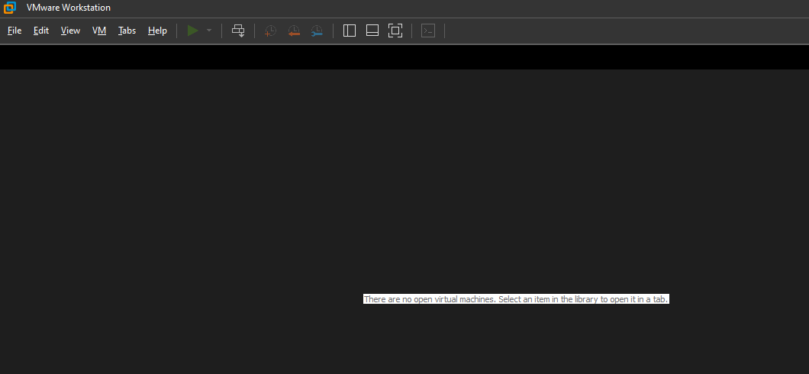

### שלב 2: התקנת Ubuntu על VMware Workstation

1. **הורדת קובץ התקנת Ubuntu (ISO):**
   - גש לאתר הרשמי של Ubuntu [כאן](https://ubuntu.com/download).
   - הורד את גרסת ה-ISO העדכנית של Ubuntu. גרסה מומלצת היא Ubuntu Desktop (לשימוש כללי).

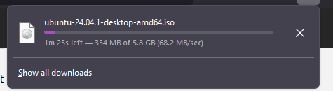

2. **יצירת מכונה וירטואלית חדשה:**
   - פתח את VMware Workstation.
   - לחץ על "Create a New Virtual Machine" במסך הבית.
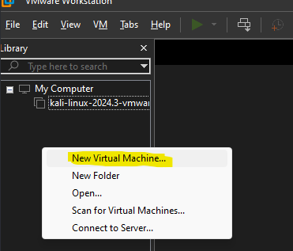
   - בחר באפשרות "Typical (recommended)" ולחץ על "Next".
    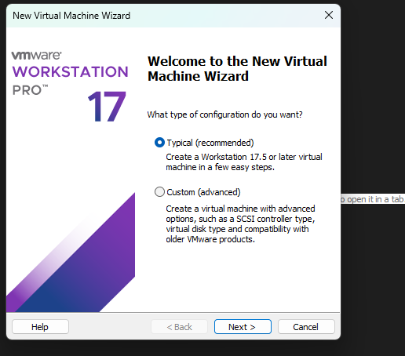
   - בחר באפשרות "Installer disc image file (iso)" והזן את הנתיב לקובץ ה-ISO שהורדת. לחץ על "Next".
    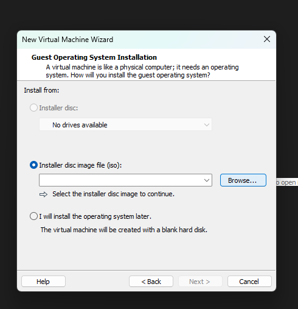
    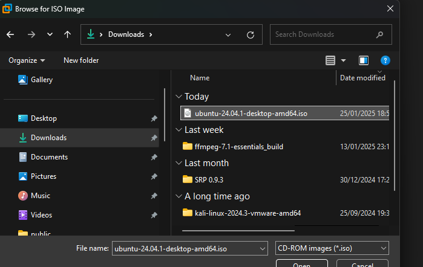
    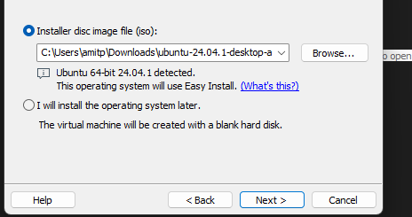
   - הזן פרטים כגון שם משתמש וסיסמה (שתצטרך להשתמש בהם לאחר התקנת Ubuntu). לחץ על "Next".
    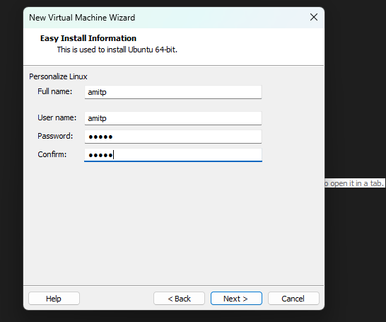
   - בחר שם ותיקייה לאחסון המכונה הווירטואלית ולחץ על "Next".
   - בחר את גודל הדיסק הקשיח הווירטואלי (מומלץ להקצות לפחות 25 GB) ולחץ על "Next".
    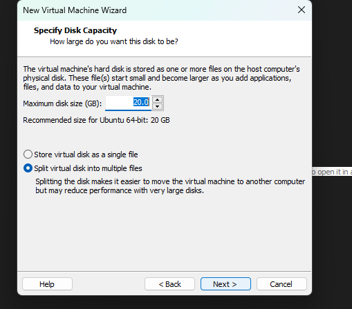
   - בסוף, תוכל לעבור על כל ההגדרות, ולחץ על "Finish" להשלמת התהליך.

3. **התקנת Ubuntu:**
   - לאחר לחיצה על "Finish", המכונה הווירטואלית תתחיל לפעול והתקנת Ubuntu תתחיל.
    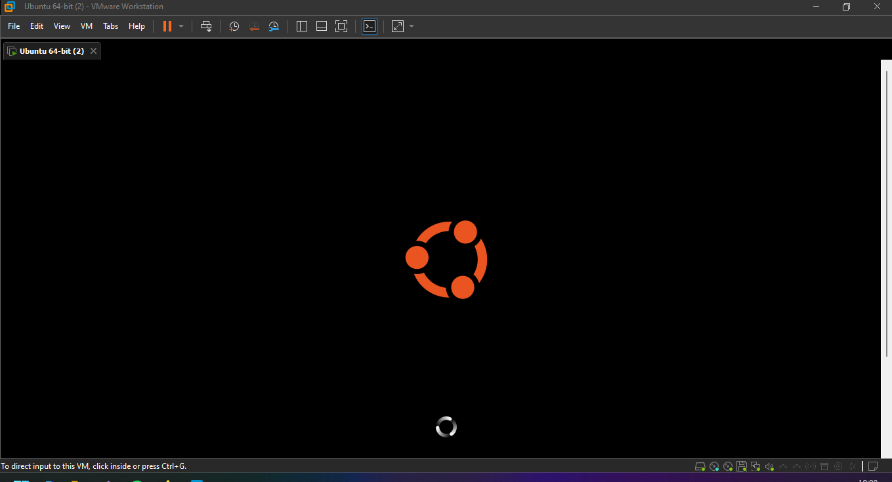
   - עקוב אחר ההנחיות על המסך כדי להתקין את Ubuntu במכונה הווירטואלית.
   - בתהליך ההתקנה, תוכל לבחור את שפת המערכת, לאשר את סוג ההתקנה, לבחור אזור זמן, ולקבוע פרטים נוספים.
    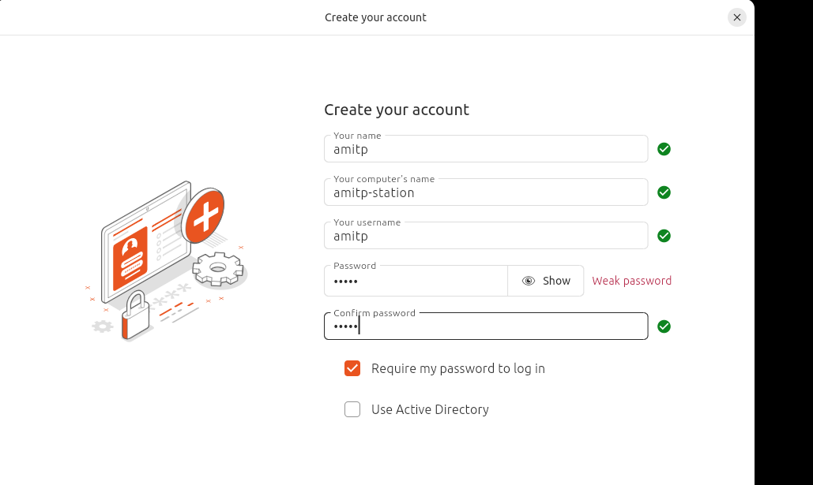
   - לאחר השלמת ההתקנה, Ubuntu יאתחל ויכנס למערכת החדשה שהתקנת.

### שלב 3: הפעלת Ubuntu על VMware Workstation

1. **הפעלת המכונה הווירטואלית:**
   - לאחר סיום ההתקנה, תוכל להפעיל את המכונה הווירטואלית מהתפריט הראשי של VMware Workstation.
   - לחץ על "Power on this virtual machine" כדי להפעיל את Ubuntu.

2. **כניסה למערכת:**
   - לאחר boot המערכת, תתבקש להזין את שם המשתמש והסיסמה שהגדרת במהלך ההתקנה.
   - הזן את הפרטים הללו ותיכנס למערכת.

3. **התקנת כלים נוספים (VMware Tools):**
   - מומלץ להתקין את VMware Tools במכונה הווירטואלית כדי לשפר את הביצועים והאינטגרציה בין המערכת הווירטואלית למערכת המארחת.
   - לאחר כניסה ל-Ubuntu, בחר "Install VMware Tools" מהתפריט של VMware Workstation, עקוב אחר ההנחיות שעל המסך כדי להתקין את הכלים.