### מדריך לשימוש ראשון ב-Ubuntu
ברוך הבא ל-Ubuntu! המדריך הזה יעזור לך להכיר את המערכת ולהתחיל להשתמש בה בצורה פשוטה, מבלי להשתמש בטרמינל.
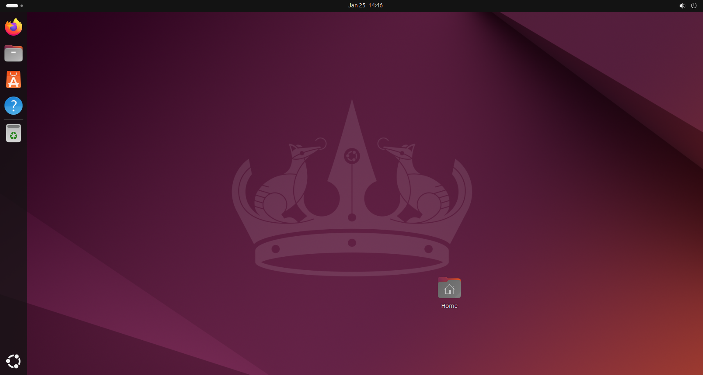
### 1. הכרת interface המשתמש
לאחר הכניסה למערכת, תמצא את עצמך בסביבת שולחן העבודה של Ubuntu, הנקראת GNOME (אחת מתוך המון)

- **שורת המשימות (Top Bar):**
  - בפינה הימנית העליונה תמצא את תפריט ההפעלה והכיבוי, מצב סוללה (במחשבים ניידים), שעון וגישה להתראות.
  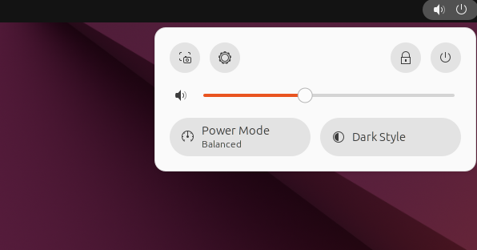
  - בפינה השמאלית העליונה תמצא את תפריט הפעילויות (Activities) שדרכו ניתן לחפש ולהפעיל תוכנות.
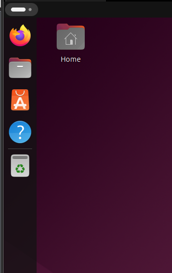

- **תפריט ההפעלה (Activities):**
  - לחץ על "Activities" בפינה הימנית העליונה או לחץ על מקש `Super` (המפתח עם סמל ה-Windows) במקלדת שלך. תפריט זה מאפשר לך לחפש תוכנות, קבצים והגדרות, וכן להפעיל תוכנות שנמצאות בשימוש תדיר.
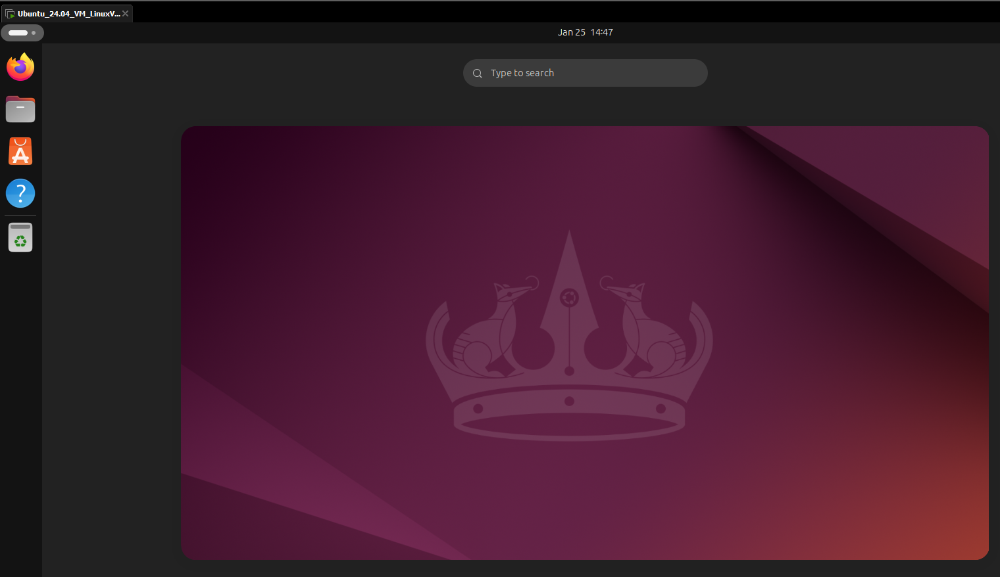

- **חלון יישומים (Applications):**
  - לחץ על "Show Applications" בתחתית המסך כדי לראות את כל היישומים המותקנים. זה דומה ל-"Start Menu" במערכת Windows.
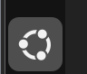
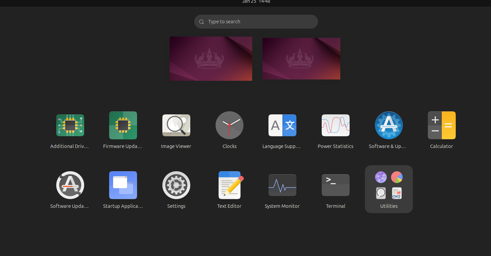
### 2. חיבור לרשת
- **רשת אלחוטית (Wi-Fi):**
  - לחץ על סמל ה-Wi-Fi בשורת המשימות העליונה (Top Bar).
  - בחר את הרשת שאליה ברצונך להתחבר, הזן את הסיסמה (אם נדרשת), והתחבר.

- **רשת קווית (Ethernet):**
  - אם חיברת את המחשב שלך עם כבל רשת, Ubuntu יזהה אוטומטית את החיבור ולא תצטרך לבצע כל פעולה נוספת.

### 3. הגדרות מערכת
כדי להתאים את המערכת לצרכים שלך, תוכל לגשת להגדרות דרך "Settings" בתפריט היישומים.
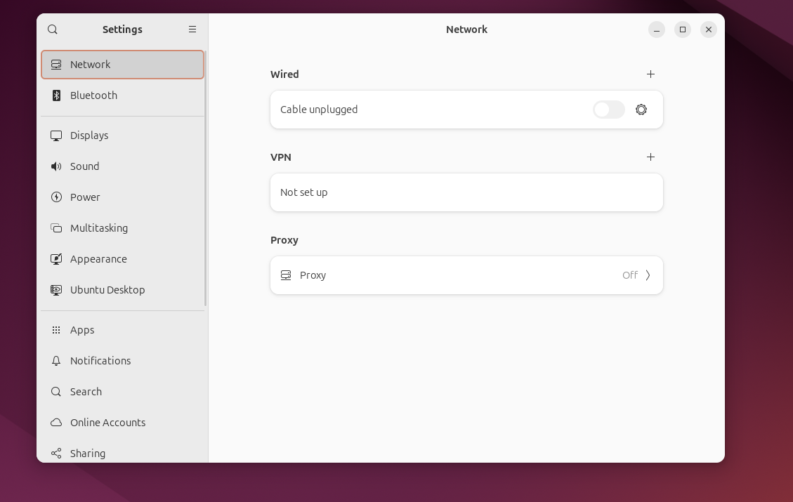
- **שפה ואזור זמן:**
  - ב-"Settings" עבור ל-"Region & Language" כדי לשנות את השפה, פריסת המקלדת ואזור הזמן.

- **רקע שולחן עבודה:**
  - לחץ עם הלחצן הימני על שולחן העבודה ובחר "Change Background" כדי לשנות את הרקע לרקע מועדף.

- **עדכונים:**
  - ב-"Settings" עבור ל-"Software & Updates" כדי לוודא שהמערכת מעודכנת. תוכל להגדיר את המערכת כך שתעדכן אוטומטית את התוכנות וההגדרות.

### 4. שימוש בתוכנות בסיסיות
מערכת ההפעלה Ubuntu מגיעה עם מספר תוכנות מותקנות מראש שמספקות את רוב הצרכים הבסיסיים.

- **דפדפן אינטרנט:** Firefox מותקן כברירת מחדל. תוכל למצוא אותו בתפריט היישומים ולגלוש באינטרנט.
  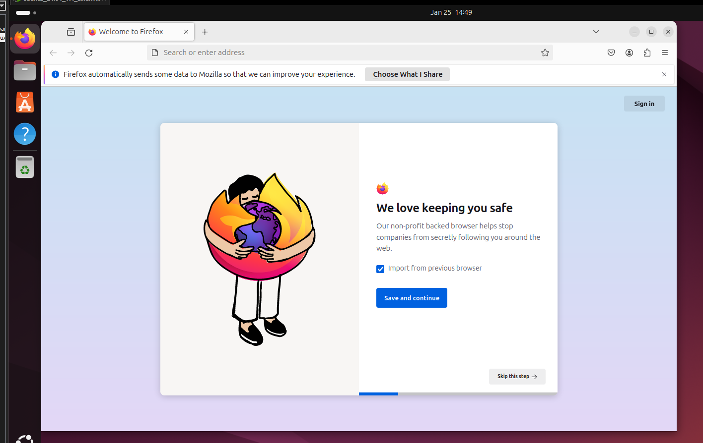
- **מנהל קבצים:** מנהל הקבצים נקרא "Files" או "Nautilus", והוא מאפשר לך לנהל קבצים ותיקיות בקלות.
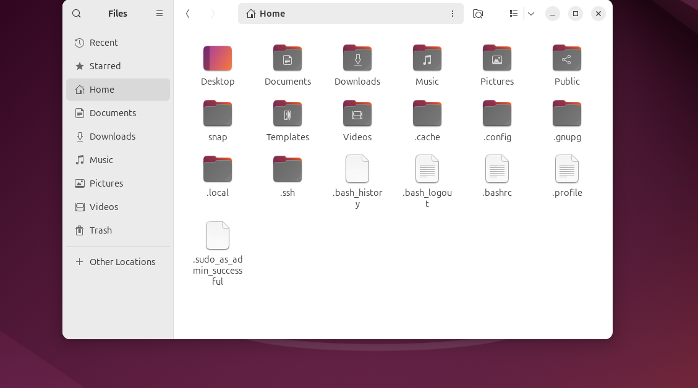

### 5. התקנת תוכנות נוספות
למרות ש-Ubuntu מגיעה עם מספר תוכנות בסיסיות, ייתכן שתרצה להתקין תוכנות נוספות.

- תוכנת **Ubuntu Software Center:** 
  - זהו מרכז ההתקנות של Ubuntu שמאפשר לך לחפש ולהתקין תוכנות חדשות בקלות.
  - פתח את "Ubuntu Software" מתפריט היישומים, חפש את התוכנה הרצויה ולחץ על "Install".

### 6. סגירת המערכת או כניסה למצב שינה
כדי לכבות את המערכת או להעביר אותה למצב שינה:

- לחץ על סמל המערכת בפינה השמאלית העליונה של המסך ובחר באפשרות הרצויה: "Power Off" כדי לכבות את המחשב או "Suspend" כדי להעביר אותו למצב שינה.

## 7. הטרמינל
כדי לפתוח את הטרמינל, בשמאל למעלה תמצאו את האייקון של הטרמינל- מזכיר את האייקון של CMD.
- לאחר שתפתחו את הטרמינל יופיע לכם טרמינל דומה לאחד שאנחנו מכירים מווינדוס.
- בשיעורים הבאים נלמד לתפעל את מערכת ההפעלה מהטרמינל.

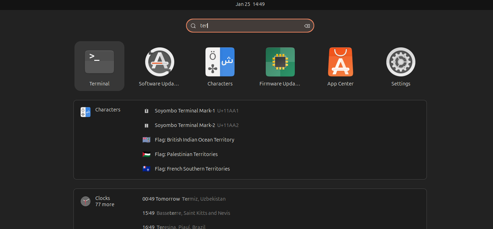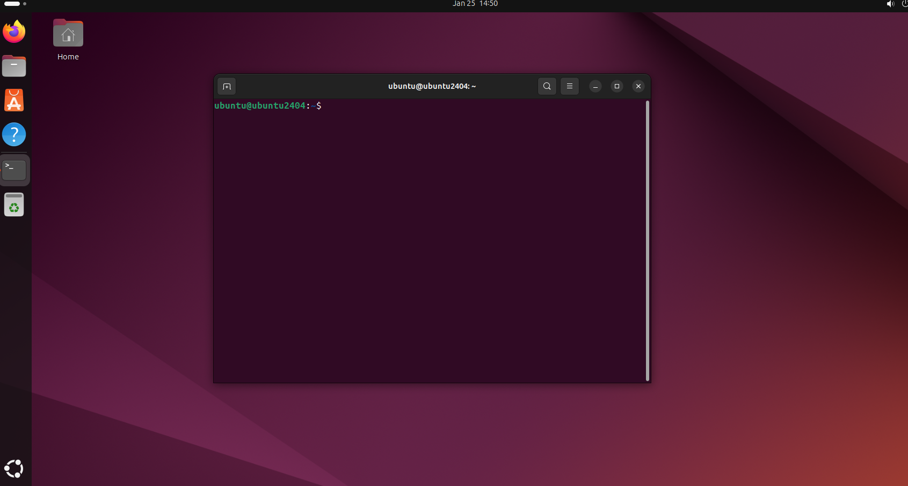