## הקדמה
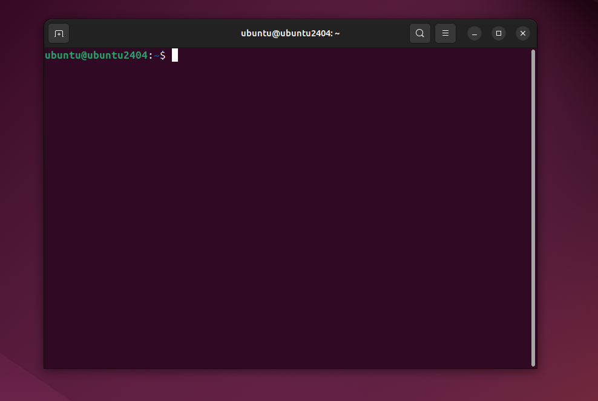
 - בשיעורים הבאים נלמד על הטרמינל בלינוקס, פתחו אותו! (לחצו על winkey וכתבו terminal)
 - מה הוא טרמינל? לאנשים שלא הספיקו להכיר טרמינל היא תוכנה שדרכה אנחנו יכולים לשלוט על כל מערכת ההפעלה דרך "שרת פקודה", שבה אנחנו כותבים פקודות ובכך שולטים על מערכת ההפעלה.
 - מה הוא shell? טרמינל היא בעצם התוכנה שמריצה את הshell-ים. shell היא התוכנה שמאפשרת לנו להריץ פקודות, כאשר בכל shell בדרך כלל יש פקודות שונות ודרך קצת אחרת לתקשר עם מערכת ההפעלה. דרך הטרמינל של אובנטו למשל, אנחנו יכולים להשתמש במספר shell-ים שונים.
- בלינוקס יש המון סוגים של shell-ים.
בשיעור הבא נלמד את הshell הפופלרי ביותר bash

## פקודות בסיסיות
- `whoami` - מדפיסה איזה משתמש מחובר כרגע
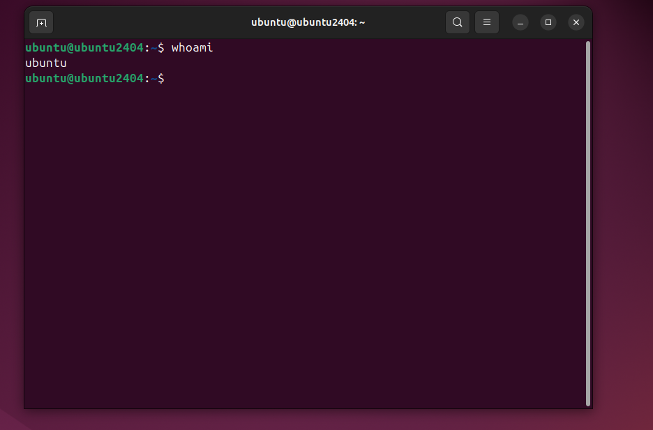
המשתמש שלי נקרא "ubuntu"
- הפקודה  `echo` - מדפיסה תוכן למסך
  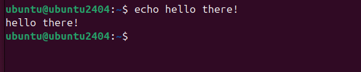

- הפקודה  `uname -a` - מציגה את גרסת לינוקס
	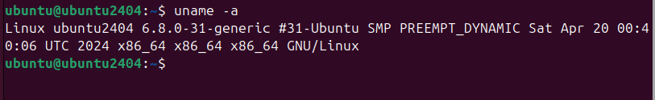
- הפקודה  `ps -x` - מציגה processes (תוכנות) שרצים כרגע
  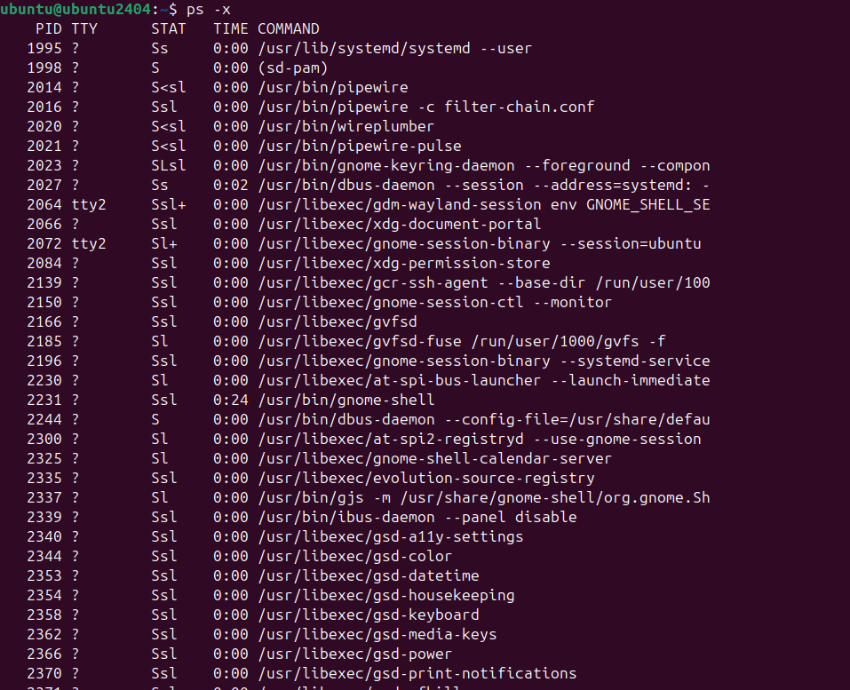
- הפקודה `top` - מציגה processes שרצים ושימוש במשאבים
  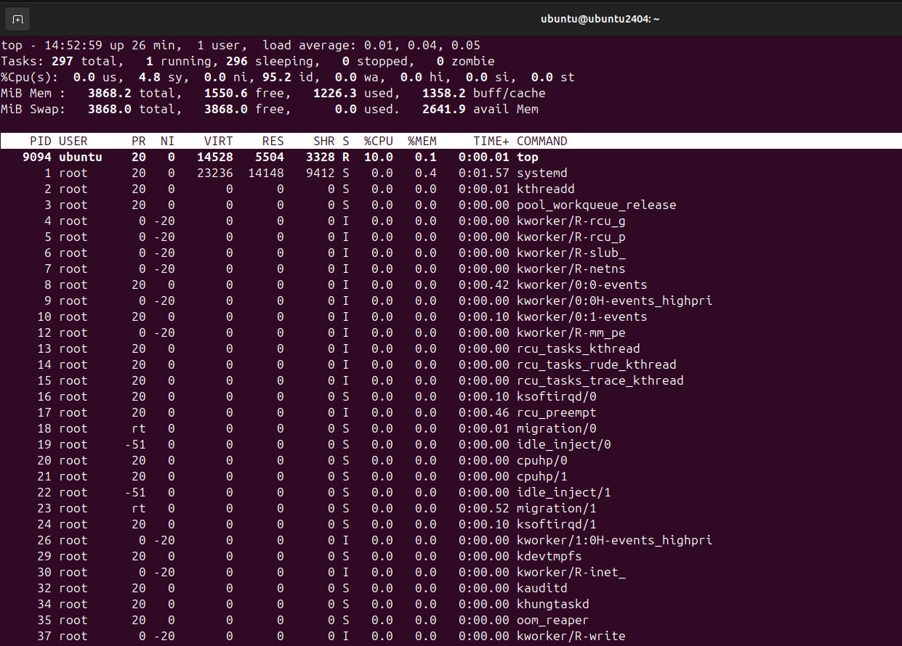
- הפקודה  `df` - מציגה שימוש בדיסק
  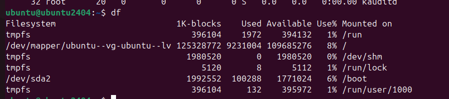
- הפקודה `clear` - מנקה את המסך
- הפקודה `exit` - יוצאת מה-shell

## הפקודה היחידה שצריך להכיר
הפקודה man היא החבר הכי טוב שלכם, הפקודה יכולה להציג לכם דף מדריך לרוב הפקודות שתתקלו בהם בלינוקס, כולל קונספטים בלינוקס ועוד.
- הפקודה `man` - המדריך של לינוקס
  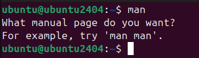
- הפקודה `man uname` - פותח את המדריך של הפקודה `echo`
  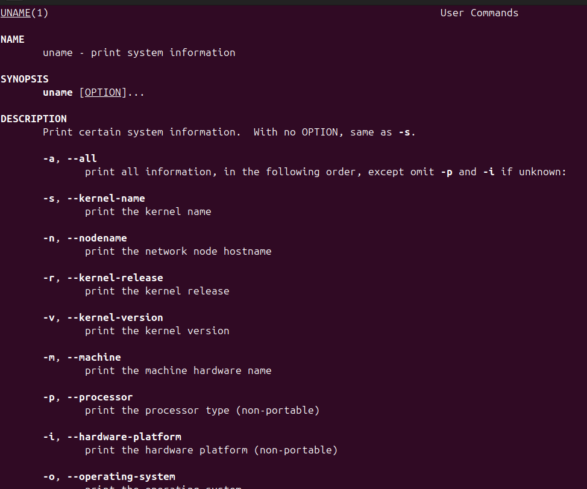
- הפקודה `uname --help` - לרוב הפקודות בלינוקס יש דגל עזרה מובנה
  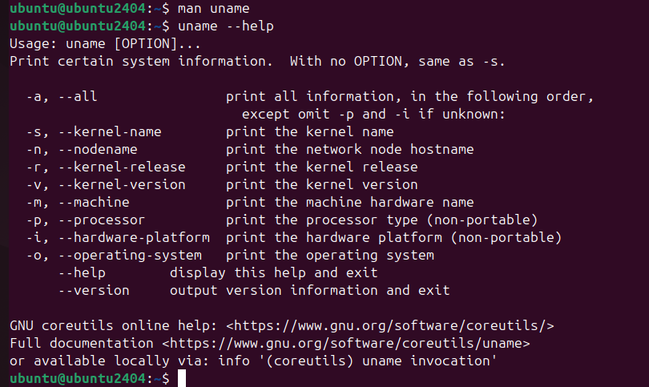
- הפקודה `sudo mandb` - תוודא שיש לכם את הman הכי מועדכן! הריצו אותה, היא תבקש מכם את הסיסמא שלכם- הקלידו אותה והריצו.
- הפקודה `man -k uname` - מחפש מדריך למונח `uname`
  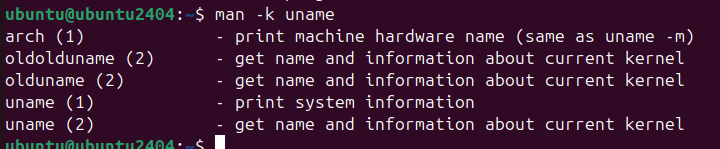
- הפקודה `man man` - פותח את המדריך של `man`
