## מערכת קבצים
השיעור נלמד כיצד להתעסק עם קבצים ולנווט בין תיקיות.
- הפקודה `pwd` - מדפיסה את התקייה הנוכחית שהShell שלי נמצא בה
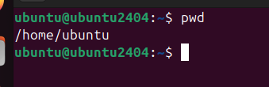
כלומר, כרגע אנחנו בתקייה ubuntu שנמצאת בתקייה home.
- הפקודה  `cd` - משנה תקייה - משנה את התקייה הנוכחית
```bash
pwd
cd /home
pwd
```
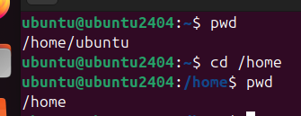
ניתן לראות שעכשיו אנחנו בתקייה home.

```
pwd
cd /home/ubuntu/Downloads
pwd
```
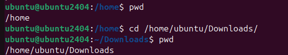
הנתיב ".." מחזיר נתיב של תקייה אחורה. כלומר אם נעשה `cd ..` נחזור תקייה אחורה.


```
cd ..
pwd
```
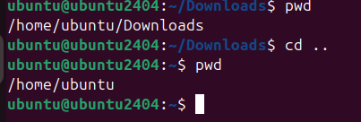
הנתיב "." מחזיר לנו את התקייה הנוכחית. כלומר אם נעשה cd ./some_folder הנתיב שיתקבל הוא הנתיב שאנחנו נמצאים בו כרגע + התקייה some_folder

```
cd ./Downloads
pwd
```
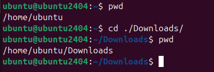
בתחתית עץ התיקיות יש את תקיית השורש, תקיית "root"- אשר נתיב שלה הוא "/"
```
cd /
pwd
```
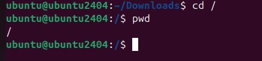

כדי לחזור לתקייה הקודמת שהיינו בה, נכתוב את הפקודה `cd -`
```
cd -
pwd
```
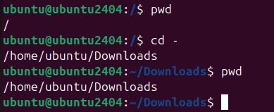
- בדרך כלל למשתמשים בלינוקס יש תקיית בית, השם של המשתמש שלי הוא "ubuntu". כל תקיות הבית נמצאות ב`home/`, כלומר תקיית הבית של המשתמש שלי תהיה ב`home/ubuntu/`. כדי להיכנס לתקיית הבית של המשתמש שאילו אני מחובר (המשתמש ubuntu במקרה הזה) אפשר לעשות "cd ~"
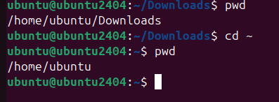
בדומה ל ".." ו- "." אפשר להשתמש גם ב "~" כדי לגשת לתקייה מסויימת:
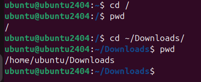
ובדומה לכך גם:
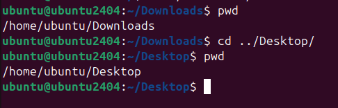
- הפקודה `ls` - מציגה את כל הקבצים בתקייה הנוכחית, ניתן לראות למשל את כל התיקיות והקבצים בתיקיית היוזר שלנו כך:
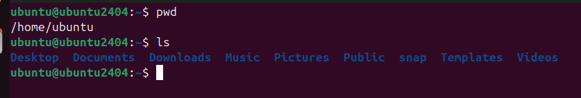
לא חייב להיות בתקייה מסויימת כדי לראות את הקבצים שלה, אפשר גם לכתוב את הפקודה `ls` ולהביא לה נתיב מסויים:
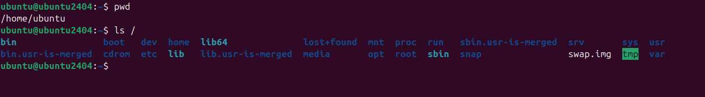

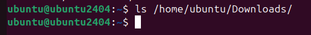
ניתן לראות שאין לי קבצים בתקיית הDownloads
כמובן שניתן להשתמש ב".", "..", "~" גם עם ls כמו כל פקודה.
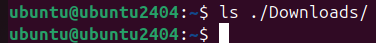

- הפקודה `echo "hello" > my_file` - תיצור קובץ חדש בשם `my_file` עם תוכן: "hello"
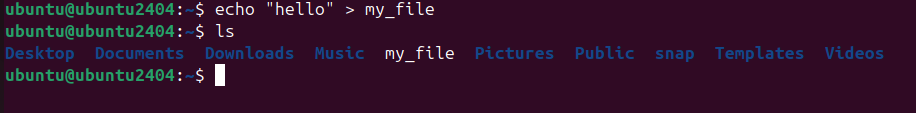

הפקודה - `cat` - מחבר (concatenate) - מדפיסה את תוכן הקבצים למסך
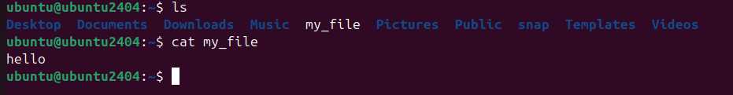
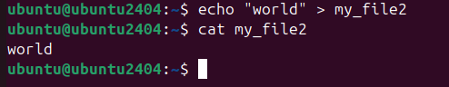
ניתן להשתמש בcat גם כדי להדפיס כמה קבצים ביחד:
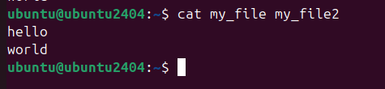
- נפרק את הפקודה  `echo "hello" > my_file` - החלק הראשון הוא `echo "hello"` שאחראי להדפיס למסך "hello", לאחר מכן יש `> my_file` שאחראי להעביר את כל הפלט של הפקודה הקודמת לתוך הקובץ my_file.
- אפשר להשתמש באותו עקרון עם הפקודה cat, שמדפיסה תוכן של קובץ למסך.
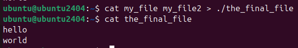
- אם נרצה להוסיף תוכן חדש אחרי תוכן קיים בקובץ (כלומר append) נשתמש באופרטור "<<":
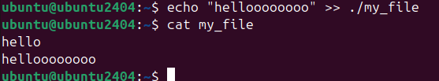
- אם נרצה להשתמש באותיות מיוחדות, כמו `\n` כדי לרדת שורה נשתמש בדגל "-e" עם echo:
  

- הפקודה `head -n 2` - מציג את שתי השורות הראשונות של הקובץ - מציג את עשר השורות הראשונות אם לא מציינים הדגל `-n`.
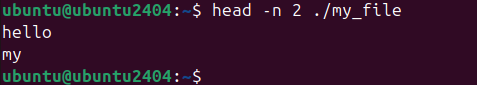

- הפקודה `tail -n 2` - מציג את שתי השורות האחרונות של הקובץ - מציג את עשר השורות האחרונות אם לא מציינים דגל
  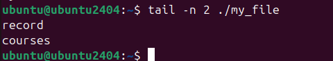
נוריד את התמלול של "אליס בארץ הפלאות" בפקודה הבאה:
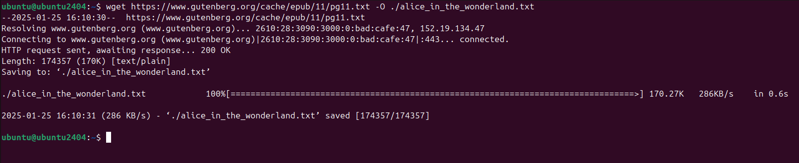
נעשה head ו- tail לקובץ הארוך שקיבלנו.
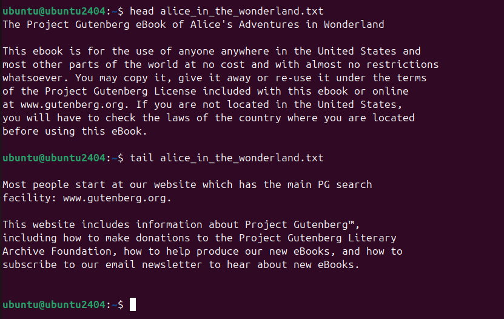

- הפקודה `less` - מציג קבצים ארוכים בטרמינל
```bash
less ./alice_in_the_wondeland.txt
```
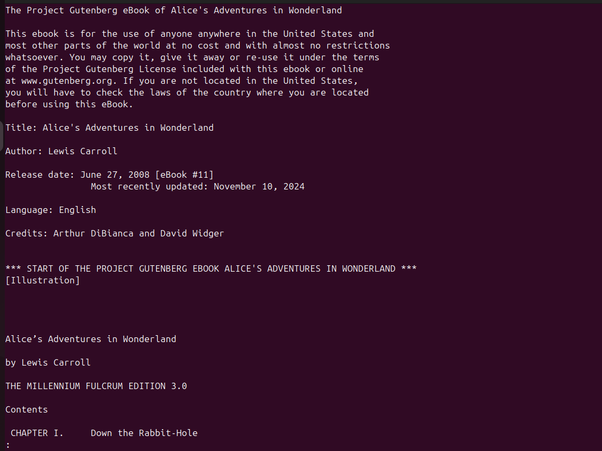
עם החצים נוכל לרדת ולעלות, וכשנרצה לצאת נלחץ על q. אם נלחץ על / נוכל ממש לחפש תוכן.
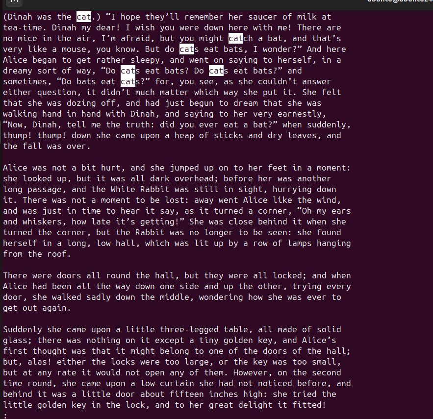
הנה התוצאה שקיבלתי שלחצתי על / בשביל חיפוש וכתבתי "cat" ואנטר.

- הפקודה `rm` - מוחקת קובץ 
```bash
rm ./my_file
ls 
```
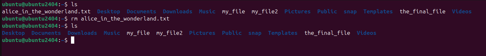

- הפקודה `mkdir` - יוצרת תקייה חדשה
- הפקודה `rmdir` - מוחקת תקייה
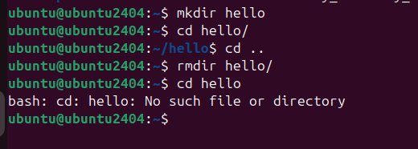

- הדגל `ls -l` - מציג את כל הקבצים אבל עם יותר פרטים
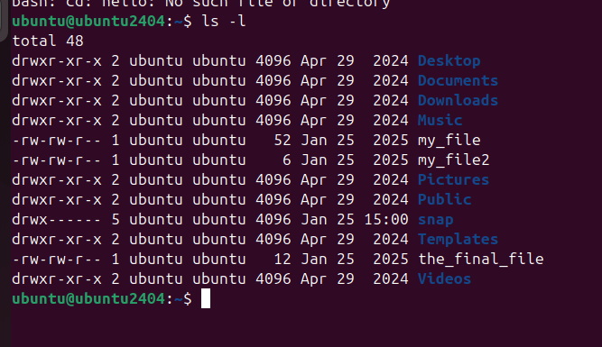


- הפקודה `touch` - משנה את התאריך של קובץ מסויים שמופיע בls -l, או יוצרת קובץ אם הקובץ לא קיים:
  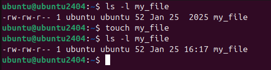
  ניתן לראות שהזמן שהשתנה.
  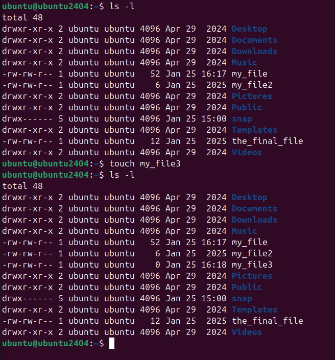

- הפקודה `mv` - מעבירה קובץ ממיקום אחד למיקום אחר
ניצור קובץ חדש:
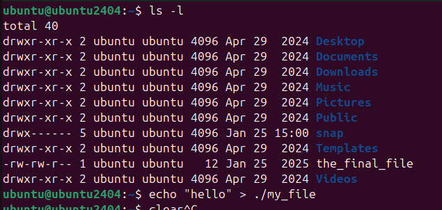
נעביר את הקובץ מ ./my_file ל- ./my_file2
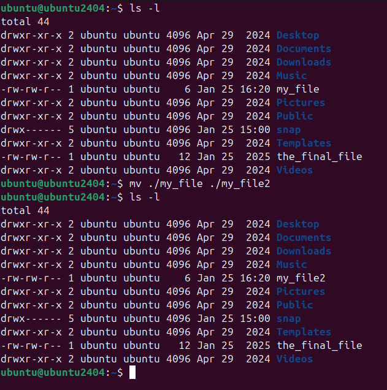
ניתו לחשוב על mv כמו שינוי שם של קובץ.

- הפקודה `cp` - מעתיקה קובץ ממיקום אחד למיקום אחר
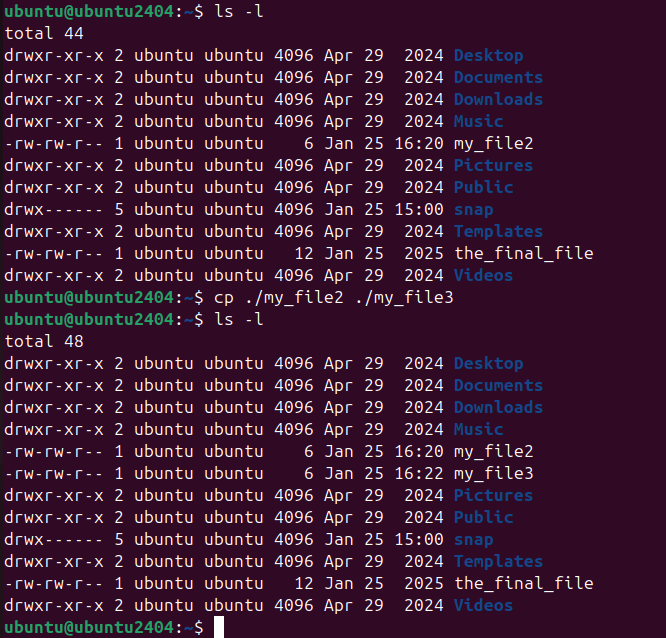

- הפקודה `nano` - עורך טקסט
```bash
nano ./my_file
```
יפתח לכם עורך טקסט:
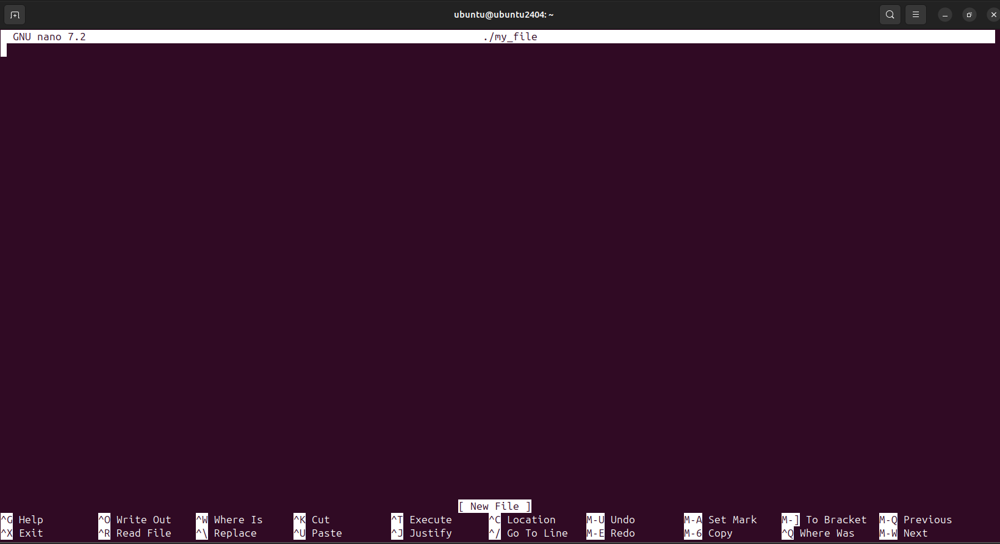
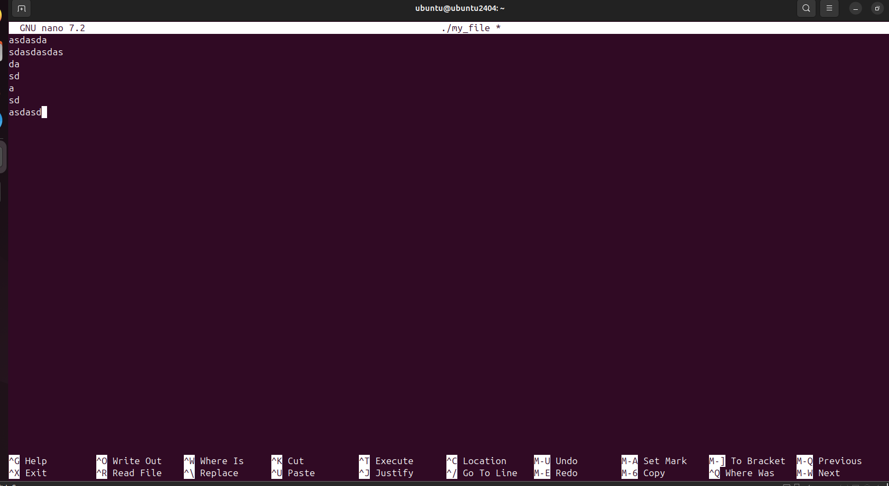
אחרי שנסיים להקליד את התוכן שלנו נוכל לשמור אותו עם מקש "ctrl + o" ולחיצה על אנטר
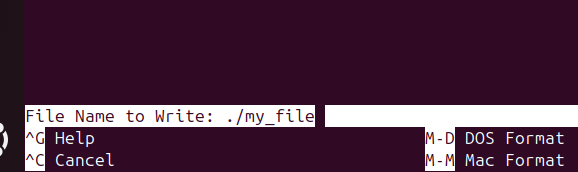
כדי לצאת העורך טקסט נלחץ על "ctrl + x"

- קבצים מוסתרים: `.hidden-file` - קבצים מוסתרים הם קבצים שמתחילים בנקודה `.`
- הפקודה `ls -a` - מציגה את כל הקבצים במצב ארוך כולל קבצים מוסתרים
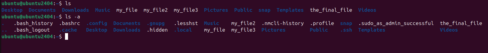

- הפקודה `file`: תציג לנו את סוג הקובץ לפי התוכן שלו
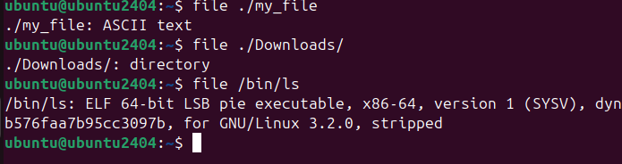

- הפקודה `find` - מחפשת קבצים 
הפקודה הבאה מחפשת בתוך התקייה /home רקורסיבית האם יש קובץ בשם my_file
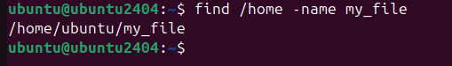
יש המון דגלים לfind, מוזמנים לעשות man או --help