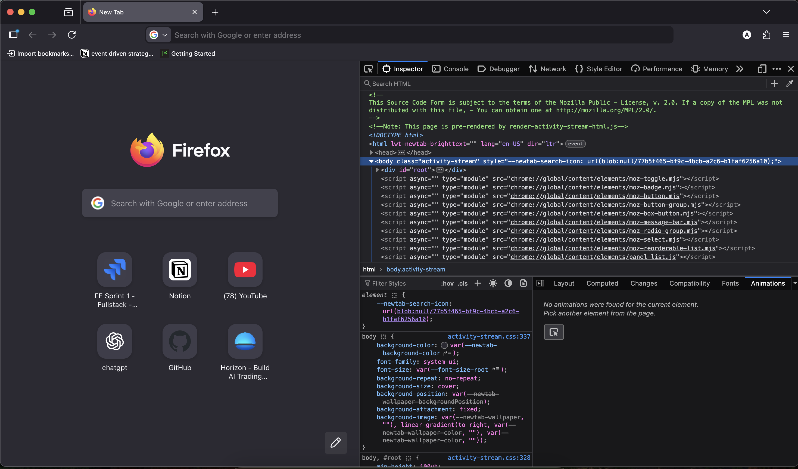
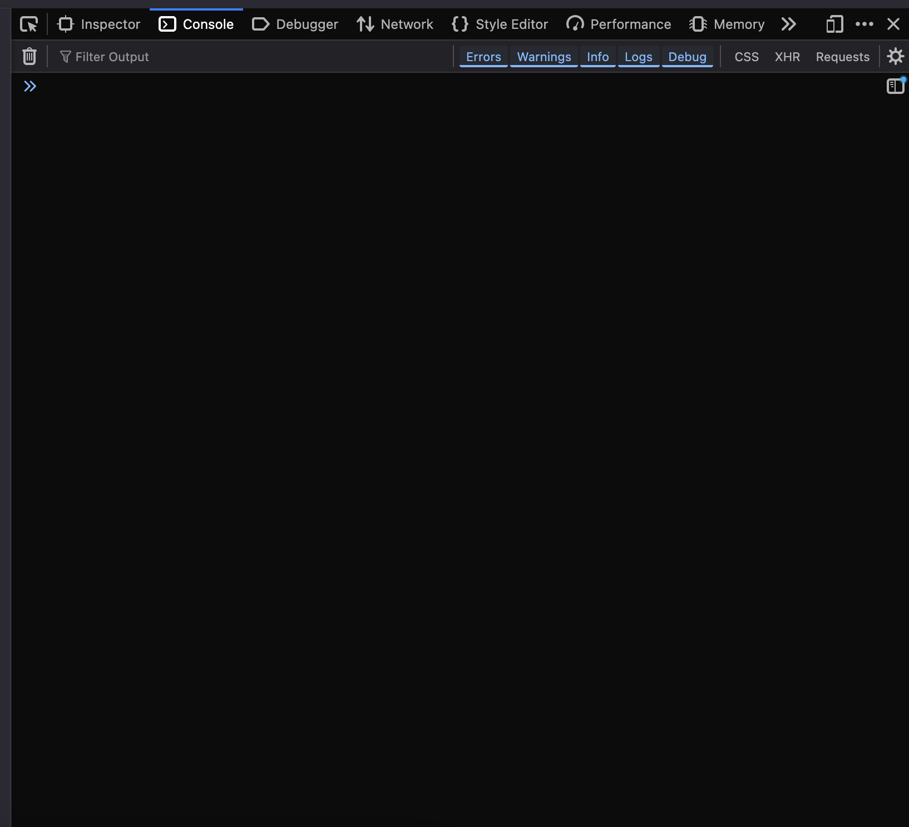

## **פרק 1: מה זה JavaScript?**
שפת JavaScript היא שפת תכנות דינמית המאפשרת **אינטראקטיביות בדפי אינטרנט**.  
- רצה **בדפדפן** (צד לקוח).  
- משמשת לבניית אפליקציות ווב, משחקים, אנימציות ועוד.  

### **שילוב קוד JavaScript**
```html
<!-- 1. Inline code -->
<script>
  console.log("Hello World!");
</script>

<!-- 2. External file -->
<script src="script.js"></script>

<!-- 3. Direct code in an event -->
<button onclick="alert('Clicked!')">Click here</button>
```


## הבסיס
כדי להתאמן על כתיבת קוד בשפה, תוכלו לפתוח את ה״developer tools" בדפדפן שלכם.
פתחו את הדפדפן שלכם ולחצו על ״f12" או ״ctrl + shift + i".

יפתח לכם חלונית כזו, מצד ימין.
- אני משתמש בfirefox ובdark mode, אולי אצלכם העיצוב יראה קצת שונה.

למעלה יהיה לכם כל הלושניות השונות- כרגע אנחנו בלושנית הinspector, שאיתה אנחנו יכולים לראות את הhtml + css שמוצג לפנינו.
לחצו על לושנית ה"console"

כאן תוכלו לכתוב איזה קוד js שתרצו בconsole אינטרקטיבי (כמו ipython).

## מעבר זריז על java script
#### שלום עולם
כדי להדפיס בconsole נוכל להשתמש ב:
```javascript
console.log("hello");
console.log(5);
console.log(10+10*2);
```
כל ביטוי בjava script נגמר ב;
#### משתנים
כדי להציב משתנים בjava script אנחנו צריכים לכתוב את המילה השמורה ״let" ואז שם המשתנה והערך.
```js
let age = 30; // number
let name = "Dan"; // string
let isStudent = true; // boolean
let fruits = ["apple", "banana"]; // array
let person = { name: "Dan", age: 30 }; // object
let empty = null; // null
let notDefined; // undefined
```
כדי ליצור משתנה גלובלי, (לרוב לא נרצה) במקום להשתמש בlet נוכל להשתמש בvar.
```javascript
var a = 1;
```
כדי ליצור משתנה constant (שערכו לא משתנה) במקום בvar נשתמש בconst
```javascript
const a = 1;
```
#### תנאים 
```js
let hour = 14;
if (hour < 12) {
  console.log("Good morning!");
} else if (hour < 18) {
  console.log("Good afternoon!"); // will be printed
} else {
  console.log("Good evening!");
}
```
#### לולאות
```js
// loop over an array
let fruits = ["apple", "banana", "pear"];
fruits.forEach(fruit => console.log(fruit));

// for-of loop
for (let fruit of fruits) {
  console.log(fruit);
}
```
#### פונקציות
```js
function greet(name="guest") {
  return `hello, ${name}!`;
}
console.log(greet());
```
בjava script יש גם למבדות, הן נקראות ״arrow functions"
```js
const multiply = (a, b) => a * b;
console.log(multiply(2, 3)); // 6
```

## **פרק 5: עבודה עם DOM**
הDOM הוא בעצם המבנה של האתר, אפשר לחשוב על זה כמו הhtml של האתר.
נוכל לגשת לdom ולשחק איתו בקוד שלנו כך:
### **בחירת אלמנטים**
```js
// by id
let header = document.getElementById("header");

// by class (returns an array)
let items = document.querySelectorAll(".item");

// by tag
let paragraphs = document.getElementsByTagName("p");
```
לאחר שחברנו אלמנט, נוכל לעשות איתו דברים כגון:
```js
let title = document.querySelector("h1");
title.style.color = "blue";

document.getElementById("myText").innerText = "The text has changed!";

let newElement = document.createElement("p");
newElement.innerText = "New paragraph";
document.body.appendChild(newElement);
```

### **הוספת אירועים**
נוכל להוסיף פעולות javascript שירוצו באירועים מסויימים שקורים לאלמנטים, לדוגמה:
```js
document.getElementById("myBtn").addEventListener("click", () => {
  alert("The button was clicked!");
});
```
עכשיו כאשר מישהו ילחץ על הכפתור עם הID: "myBtn" תרוך הפונקציה alert שמקפיצה הודעה על המסך.

---

## **פרק 6: אירועים נפוצים**
| **אירוע**       | **תיאור**                     |
|----------------|------------------------------|
| `click`        | לחיצה על אלמנט               |
| `mouseover`    | מעבר עכבר מעל אלמנט          |
| `keydown`     | לחיצה על מקלדת               |
| `submit`      | שליחת טופס                   |
| `load`        | טעינת דף/תמונה               |

---

## **פרק 7: Debugging עם Chrome DevTools**
### **פתיחת הכלים**
- **קיצור דרך**: `F12` או `Ctrl+Shift+I` (Windows) / `Cmd+Opt+I` (Mac).
- **לחיצה ימנית** → "בחינה" (Inspect).

### **כלים שימושיים**
1. **Console**  
   - הרצת קוד JS ישירות.
   - הצגת הודעות שגיאה.
   ```js
   console.log("message");
   console.error("error!");
   ```

2. **Sources**  
   - ניהול קבצי הפרויקט.
   - הגדרת breakpoints לבדיקת קוד.

3. **Elements**  
   - עריכת HTML/CSS בזמן אמת.
   - בדיקת ה-DOM.

4. **Network**  
   - מעקב אחר בקשות לשרת (API calls).

5. **Application**  
   - ניהול cookies, localStorage.

### **דוגמה ל-Debugging**
```js
function calculate(a, b) {
  debugger; // stop here
  return a + b;
}
console.log(calculate(2, 3));
```
- הוספת `debugger` תעצור את הריצה כאשר DevTools פתוח.

---

## **פרק 8: Fetch API**
כמובן שנוכל לגרום לקוד הjs שלנו לעשות בקשות לapi כמו שלמדנו בקורס תכנות.
נוכל להשתמש בfetch כדי לבצע בקשת http.
### **בקשה פשוטה**
```js
fetch("https://api.example.com/data")
  .then(response => response.json())
  .then(data => console.log(data))
  .catch(error => console.error("Error:", error));
```

### **שליחת POST request**
```js
fetch("https://api.example.com/data", {
  method: "POST",
  headers: { "Content-Type": "application/json" },
  body: JSON.stringify({ name: "Dan", age: 30 })
});
```

---

## דוגמה לקוד
שעון דיגיטלי
   ```js
   function updateClock() {
     let now = new Date();
     document.getElementById("clock").innerText = now.toLocaleTimeString();
   }
   setInterval(updateClock, 1000);
   ```

## **סיכום**
**למדנו**:  
- משתנים, פונקציות, תנאים ולולאות.  
- עבודה עם DOM ואירועים.  
- שליפת נתונים מ-API.  
- שימוש ב-DevTools לניפוי שגיאות.  

**המלצה**: התנסו בפרויקטים קטנים כדי לחזק את ההבנה!