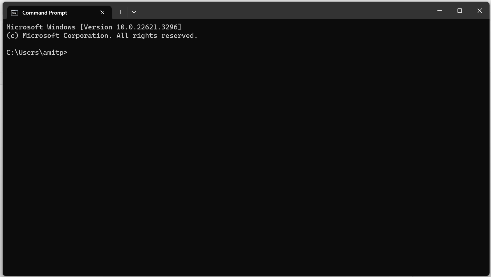
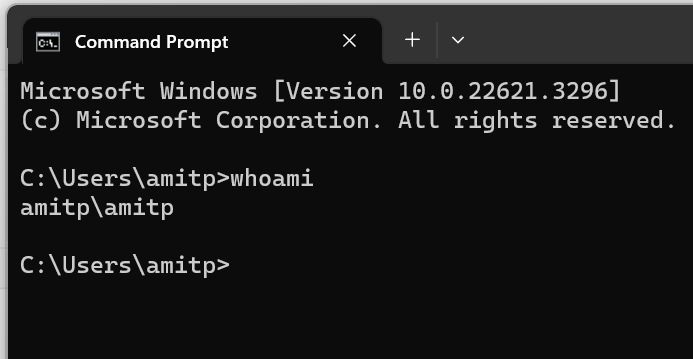
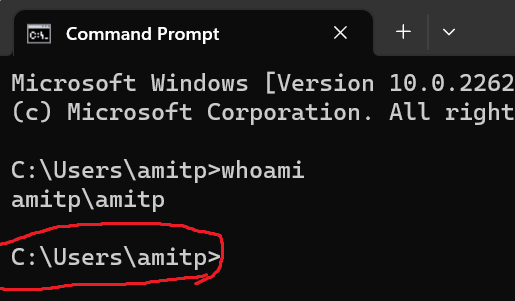
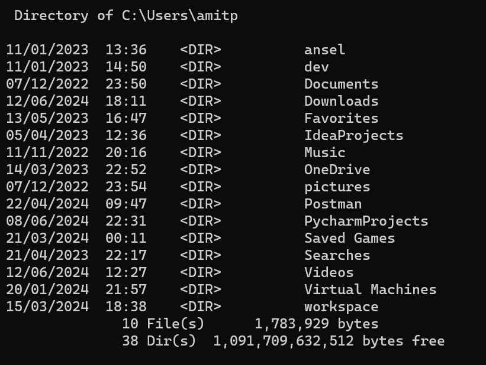
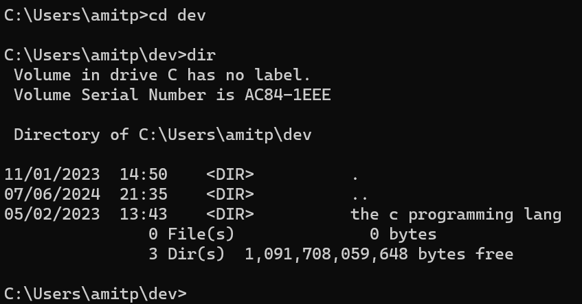
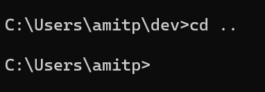

## הטרמינל

### מהו הטרמינל?

הטרמינל הוא כלי שמאפשר לנו לנהל את המחשב באמצעות "פקודות".
באמצעות הטרמינל אפשר לבצע המון סוגים של פעולות: כמו לפתוח תיקיות במחשב, ליצור קבצים, ועוד המון פעולות אחרות.

### פתיחת הטרמינל (CMD - Command Prompt)

1. לחצו על מקש הווינדוס `winkey` (כמו בשיעור הקודם), יפתח לכם חלון שבו תוכלו להקליד- הקלידו באנגלית `cmd`.
2. יוצג בפניכם תמונה של קופסה שחורה- לחצו על `Enter`.

ייפתח בפניכם המסך הבא:




זה הטרמינל, כאן אפשר להקליד פקודות ולבצע פעולות שונות במחשב.

### דוגמה לפקודה בסיסית

הפקודה `whoami` תבקש מהמחשב להציג את שם המשתמש שלנו במחשב:
הקלידו את הפקודה הבאה בטרמינל:
```cmd
whoami
```
ואז לחצו על מקש האנטר.


כאן ניתן לראות ששם המשתמש שלי הוא `amitp`.
- למעשה, נתנו למחשב פקודה- "whoami" והמחשב ביצע את הפקודה שביקשנו, זה הטרמינל :)
- יש עוד הרבה פקודות כמו 'whoami' שנוכל לעשות, אבל לא חייב להכיר את כולם כרגע.

## ניוד בין תיקיות דרך הטרמינל
כמו שלמדנו בשיעור הקודם להשתמש בסייר הקבצים כדי לזוז בין תיקיות שונות במחשב ולראות קבצים, נלמד לעשות זאת עם פקודות בטרמינל.

### איך לדעת באיזה תיקייה אנחנו נמצאים?
בכל רגע נתון הטרמינל מציג לנו את "הנתיב" שבו אנחנו נמצאים.
- "הנתיב" הוא התיקייה שבו אנחנו נמצאים.
- אם נחזור לטרמינל ונביט בצד שמאל, נוכל לראות את הנתיב שבו אנחנו נמצאים כרגע-



בדוגמה זו, הנתיב הנוכחי הוא:

```cmd
C:\Users\amitp
```

משמעותו: אנו נמצאים בתוך התיקייה `amitp` שנמצאת בתוך התיקייה `Users`, שב כונן`C:\`.

### איך לראות את הקבצים שבתיקייה הנוכחית?

ניתן להשתמש בפקודה `dir` כדי לראות את כל הקבצים והתיקיות שבתוך הנתיב שלנו:
הריצו את הפקודה הבאה בטרמינל
```cmd
dir
```
יוצגו בפניכם כל התיקיות והקבצים שיש בתיקייה הנוכחית:

בתמונה אפשר לראות המון תיקיות שיש בנתיב, לדוגמה אפשר לראות את
- התיקייה ansel
- התיקייה dev
- התיקייה Documents
- התיקייה Downloads
ועוד :)
### איך להיכנס לתיקייה מסוימת?

כדי להיכנס לתיקייה מסוימת בתוך הנתיב הנוכחי שלנו, נשתמש בפקודה `cd` (Change Directory):

```cmd
cd dev
```

ואז נריץ שוב `dir` כדי לראות מה יש בפנים:



### איך לחזור תיקייה אחת אחורה?

אם נרצה לחזור לתיקייה הקודמת, נשתמש ב:

```cmd
cd ..
```




---

## הinterface הטקסטואלי (TUI) מול הinterface הגרפי (GUI)

בטרמינל אין interface גרפי כמו בסייר הקבצים, אלא הכול מבוסס על טקסט. צורת עבודה זו נקראת **TUI - Text User Interface** (ממשק משתמש טקסטואלי). לעומת זאת, סייר הקבצים משתמש ב-**GUI - Graphical User Interface** (ממשק משתמש גרפי).

### ההבדלים בין TUI ל-GUI

|תכונה|TUI (טרמינל)|GUI (סייר הקבצים)|
|---|---|---|
|דרך שימוש|פקודות טקסט|לחיצות עכבר ותפריטים|
|מהירות פעולה|מהיר (למי שמיומן)|איטי יותר אך נוח|
|גמישות|גבוהה מאוד|מוגבלת לפיצ'רים הקיימים|
|התאמה אישית|ניתן להריץ סקריפטים ואוטומציות|מוגבל להגדרות קיימות|

---

## חזרה קצרה

- **הטרמינל** הוא תוכנה שמאפשרת לנו להריץ פקודות לניהול המחשב.
- **נתיב (Path)** מראה לנו באיזו תיקייה אנו נמצאים כרגע.
- **`cd`** מאפשר לנו לנוע בין תיקיות.
- **`dir`** מציג את הקבצים שבתיקייה.
- **TUI ו-GUI** הם שני סוגים שונים של ממשקי משתמש – טקסטואלי לעומת גרפי.

ככל שתתרגלו יותר שימוש בטרמינל, תוכלו לבצע פעולות מתקדמות במהירות וביעילות!