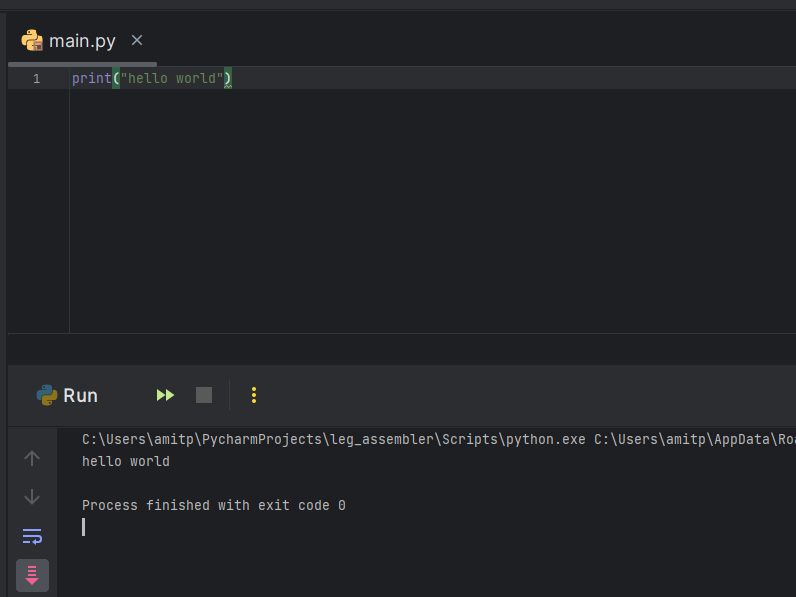
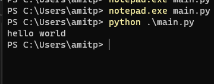
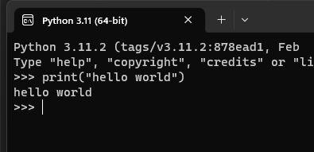

## שלום עולם. בשימוש עם PyCharm
-  כתוב קוד פייתון בשימוש PyCharm שמדפיס למסך "Hello World".

## שלום עולם. בשימוש פקודת `python`
- כתוב תוכנת "hello world" בשימוש `notepad` והפקודה `python` בטרמינל

## שלום עולם. בשימוש פייתון אינטרקטיבי
- הרץ את הפקודה `python` בטרמינל כדי להתחיל פייתון אינטרקטיבי והשתמש בו כדי להדפיס "hello world" למסך.

