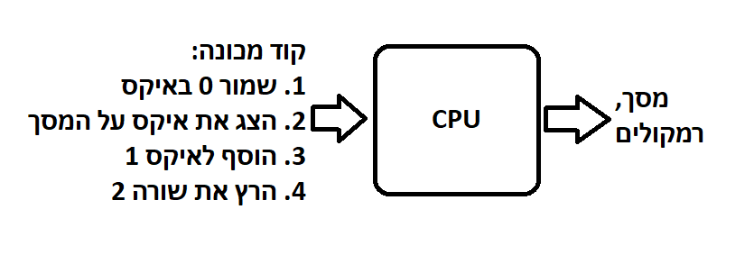
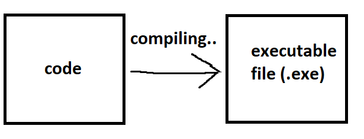

<div style="position: relative; padding-bottom: 56.25%; height: 0; overflow: hidden; margin-bottom: 20px;">
  <iframe src="https://www.youtube.com/embed/zqxW1OsNSek" style="position: absolute; top: 0; left: 0; width: 100%; height: 100%; border: 0;" allowfullscreen></iframe>
</div>

## הקדמה
- בפרק זה נדבר קצת על הבסיס שאנחנו צריכים לדעת כדי להבין איך מחשבים עובדים, ננסה להסביר איך קוד שאנחנו כותבים מצליח לרוץ על המחשב

## המעבד
- המעבד או בשמו הלועזי "CPU" או "יחידת העיבוד המרכזית" היא חלק במחשב שיודע להריץ קוד, המעבד יודע להריץ סוג של קוד שנקרא "קוד מכונה" (machine code)
- קוד מכונה הוא מספר פעולות בסיסיות מוגדרות שהמעבד פותח בצורה שיכול להריץ אותן, הנה דוגמה לפעולות:
```
1 חבר בין 3 ל 1 ושמור בx
2 הדפס את x
3 הרץ את שורה 1 שוב פעם.
```
- דמיינו שהמעבד מקבל קוד, שנראה בערך כמו שציינו למעלה, ואז הוא מוציא פלט דרך המסך, הרמקולים וכו.

- נסכם: המעבד שלנו יודע להריץ רק קוד מכונה, כותבים קוד כזה באמצעות השפת תכנות אסמבליי. הבעיה באסמבליי שהוא שפה פשוטה מאוד, בלי המון פיצ'רים וזה הופך אותה ללא נוחה כשאנחנו רוצים לכתוב כמעט כל תוכנה מודרנית.
- אז כדי לגרום למעבד להריץ את הקוד פייתון שלנו אנחנו צריכים להמיר את הקוד פייתון שלנו בצורה כלשהי לקוד מכונה, כדי שהמעבד ידע להריץ את הקוד שכתבנו בפייתון. 
- ה- "קומפיילר" היא תוכנה מיוחדת שיודעת לתרגם את הקוד שלנו לשפת מכונה.

## קומפיילר
- יש המון סוגים של קומפיילרים: לכל שפת תכנות יש קומפיילרים משלה, ולכל קומפיילר יש שיטת קימפול שונה. (הדרך שבה הוא גורם לקוד לרוץ)

#### קומפיילר "רגיל"
- השיטת קימפול הסנטדרטית והעתיקה היא קומפיילר שמקבל את כל הקוד, מתרגם את כל הקוד לשפת מכונה ומייצר קובץ הרצה מיוחד על המחשב שאנחנו יכולים להריץ אותו מתי שנרצה.
- קובץ הרצה זה קובץ על המחשב שמכיל שפת מכונה שהמעבד יודע להריץ - בווינדוס זה קבצי .exe

- השיטה הזו מעניקה לנו קובץ הרצה (קובץ exe) שנוכל להריץ אותו מתי שנרצה.
- השיטה הזו נפוצה בהמון שפות תכנות כמו C, Rust, Go

#### קומפיילר - interpreter
- בהמון שפות תכנות מודרניות כמו פייתון משתמשים בשיטת קימפול שנקראת "interpreter", הinterpreter היא תוכנה שפשוט יכולה להריץ ישירות את הקוד שלנו מבלי שום צורך לצור קובץ הרצה.
- באיזשהי צורה אפשר להסתכל על הפקודה `python` כinterpreter, כי אנחנו מביאים לה קוד פייתון והיא פשוט מריצה אותו: `python main.py` 
- תוכנת הinterpreter קוראת את הקוד פייתון שלנו, ועוברת עליו שורה, שורה ומריצה אותה.

#### קומפיילר נגד interpreter
| קומפיילר                                | הinterpreter                                                                           |
| --------------------------------------- | ------------------------------------------------------------------------------ |
| מראה שגיאות בקוד בזמן שמקמפלים את הקוד. | מראה את כל השגיאות רק שהקוד רץ.                                                |
| קוד שקומפל לקובץ הרצה ירוץ יותר מהר.    | קוד שרץ בinterpreter יהיה איטי יותר כי הinterpreter צריך לתרגם את הקוד לקוד מכונה בזמן ריצה. |
| יש צורך לקמפל.                          | אין צורך לקמפל את התוכנית.                                                     |
| צריך לשמור את הקובץ הרצה כקובץ.         | לא צריך לשמור קובץ הרצה, רק להריץ את הקוד מקור.                                |
|                                         |                                                                                |

## אופטימיזציות של interpreter
הinterpreters יכולים להיות מאוד איטיים, לשם כך יש המון יעולים שונים שהוסיפו למרשים מודרנים.

#### בייטקוד - bytecode
- לפני ריצה של הinterpreter אנחנו מקמפלים את לקוד שדומה לקוד מכונה שנקרא "בייטקוד" שהוא גרסה פשוטה יותר של הקוד המקורי, וזה קוד שקל ומהיר יותר להריץ.
- החסרון הוא שבכל פעם נצטרך לקמפל את התוכנית מחדש כמו בקומפיילר - זמן קימפול ארוך יותר, אבל הinterpreter יריץ את הקוד יותר מהר - זמן ריצה מהיר יותר.
- עוד יתרון בוהק שיש לשיטה שבגלל ש"הבייטקוד" זה לא קוד מכונה אמיתי, כל עוד יש תוכנת interpreter על מחשב כלשהו, המחשב יוכל להריץ את הבייטקוד.
  זה אומר שהקוד שלנו יוכל לרוץ על כל סוג של מחשב בעולם - טלפונים, מחשבים ואפילו מכוניות כל עוד יש להם את תוכנת interpreter. בגלל זה השיטה הזו בדרך כלל נקראת שיטת "מכונה וירטואלית" - virtual machine

#### ג'יט - JIT 
ג'יט או (just in time) היא שיטת יעול שמשלבת ביחד קומפיילר וinterpreter.
1. קודם כל מקמפלים את הקוד לbytecode, 
2. הinterpreter לפני הריצה מריץ המון אופטימזציות על הbytecode, ובכך חוסך קוד ומפשט אותו אפילו עוד יותר
3. הinterpreter בזמן הריצה עושה המון סוגים של יעולים על הקוד כדי להפוך אותו לכמה שיותר פשוט, וכמה שיותר מהיר לקמפול.
ג'יט זה קיצור של just in time (בדיוק בזמן) כי ג'יט דואג לכך שכאשר הinterpreter צריך להריץ את הbytecode הbytecode יהיה כמה שיותר מיועל, ופשוט כך שהתוכנה תריץ את הקוד מהר ביותר.

ג'יט זה המצאה נהדרת ומפתחת עד היום, למעשה עד היום (נכון ל2024) מוסיפים ומשפרים את ג'יט. בכל שפת interpreter שמכבדת את עצמה יש מנוע ג'יט.

## הinterpreters לפייתון
#### הinterpreter - Cython
- הinterpreter הכי נפוץ ומוכר של פייתון
- הinterpreter נכתב בשפת C, מזה מגיע השם.
- הinterpreter Cython קודם כל הופך את הקוד פייתון שלנו לבייטקוד, ואז מריץ אותו עם interpreter

#### הinterpreter - PyPy
- הinterpreter PyPy הוא interpreter פייתון מאוד מפרוסם עם מנוע JIT.
- המטרה של PyPy היא לצור interpreter שמהיר יותר מCPython באמצעות JIT

#### עוד ועוד
- קיימים עוד המון סוגים של interpreters לפייתון, כמו `Jython` שעובד על המנוע של שפת תכנות ג'אווה, `IronPython` שעובד על מנוע של שפות תכנות של מיקרוסופט ולכל אחד מהinterpreters יש המון יתרונות וחסרונות.
  למשל: כאשר נרצה לכתוב קוד פייתון שמתקשר עם ספריות של ג'אווה יהיה נכון יותר להשתמש ב`Jython`, כאשר נרצה לכתוב קוד פייתון שמתקשר עם ספריית `.NET` של מיקרוסופט יהיה יותר נכון להשתמש ב`IronPython`.
- זכרו: בכל פרויקט נרצה להתאים את הinterpreter שבו אנחנו משתמשים לפרויקט, למורות שלרוב זה כנראה יהיה Cython או PyPy.
- איזה interpreter אני משתמש? כנראה זה Cython. אפשר לבדוק זאת באמצעות הקוד הבא:
```python
import platform
print(platform.python_implementation())
```
- איך להחליף interpreter? מוזמנים לבדוק בגוגל בהתאם לinterpreter שאתם רוצים להחליף אילו, יש המון מדריכים.